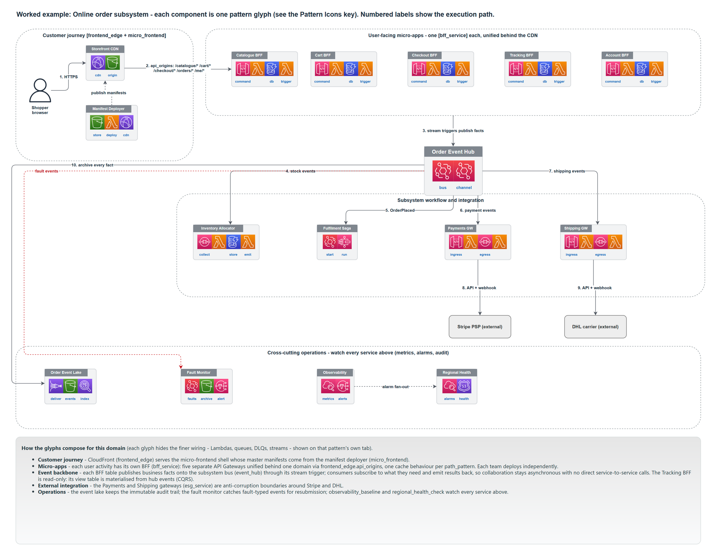

<div align="center">

# Serverless Architecture Patterns

**Production-grade Terraform for building autonomous, event-driven serverless subsystems on AWS.**

[](https://developer.hashicorp.com/terraform)
[](https://registry.terraform.io/providers/hashicorp/aws/latest)
[](#testing-and-quality-gates)

</div>

A Terraform pattern library that implements Software Architecture Patterns for Serverless Systems. It gives you hardened building blocks (Lambda, API Gateway, DynamoDB, EventBridge and the patterns built from them), a declarative way to compose them into a whole subsystem, and a paved road to deploy one. You assemble systems from proven parts instead of wiring (and re-securing) infrastructure by hand.



> *An online-order subsystem built entirely from the library. Each box is one pattern; every service collaborates through the central event hub, with no direct service-to-service calls. The numbered labels trace the execution path. See [`docs/architecture/patterns-clean.drawio`](docs/architecture/patterns-clean.drawio) for the full Pattern Icons key and a detail tab per pattern.*

> [!NOTE]
> This is a library you build *with*, not an application you deploy. The modules are consumed by reference; an application repository owns the Terraform state and the deploy. See [Deploy a subsystem](#deploy-a-subsystem).

## Overview

The library is organised in three layers, each usable on its own:

1. **Primitives** (`modules/primitives/`) wrap a single AWS resource with the library's security defaults: customer-managed KMS encryption everywhere, finite log retention, one least-privilege role per function, dead-letter queues on every async path, required tags.
2. **Patterns** (`modules/patterns/`) are the named building blocks from the book: the **event hub** every service collaborates through, **BFF** services for user activities, **control** services (event reactors and Step Functions sagas), **ESG** gateways that isolate external systems, and the operational set (event lake, fault monitor, observability baseline, regional health check, frontend edge, micro-frontend).
3. **Composition** (`modules/composition/subsystem`) is the abstraction on top: describe a whole subsystem in one declarative `subsystem.yaml` and the composer instantiates and *wires* the patterns together (hub routes, the SQS policies EventBridge needs, DLQs, glue IAM, KMS service grants, observability inputs).

The idea running through all of it: **services never call each other.** They exchange events through the hub, each owns its own data, and the resulting bulkheads stop one service's failure from cascading. Producers publish facts; consumers cache what they need. That is what makes the subsystems *autonomous*.

> [!TIP]
> Open the **Pattern Icons** page of [`patterns-clean.drawio`](docs/architecture/patterns-clean.drawio) first. It is a one-glance key to every building block referenced below, and the two worked examples (online order, payments payout) are drawn from those same glyphs.

## Features

- **Hardened building blocks**: 4 primitives and 11 patterns, each with secure, opinionated defaults baked in rather than bolted on.
- **Event-first by construction**: a central EventBridge hub, database-first event publication, and per-service data stores that keep services decoupled and resilient.
- **One manifest, a whole subsystem**: a declarative `subsystem.yaml` plus a composer that derives roughly 150-200 wired AWS resources, so you stop hand-wiring queue policies and IAM glue.
- **A paved road to production**: an app-repo template, a reusable OIDC deploy action, and a GitOps flow with a human-gated apply.
- **Quality enforced in CI**: 16 module contract tests, OPA and Sentinel policy gates, a Trivy scan, and a LocalStack smoke test.
- **Documented visually**: a 16-tab architecture diagram, every pattern as a glyph, plus end-to-end worked examples.

## The pattern catalogue

Every pattern is a composition of the primitives. Each row links to its detailed reference page (what it builds, how it works, when to use it) and to its module. The full set lives in the [pattern reference](docs/patterns/README.md).

| Pattern | What it is | Reference | Module |
| --- | --- | --- | --- |
| **Event hub** | The central bus services publish facts to and subscribe from | [docs](docs/patterns/event-hub.md) | [`event_hub`](modules/patterns/event_hub) |
| **BFF service** | Backend for one user activity: HTTP API + functions + owned table | [docs](docs/patterns/bff-service.md) | [`bff_service`](modules/patterns/bff_service) |
| **Control service** | Reacts to events: an event-reactor or a Step Functions saga | [docs](docs/patterns/control-service.md) | [`control_service`](modules/patterns/control_service) |
| **ESG service** | Anti-corruption boundary around an external system | [docs](docs/patterns/esg-service.md) | [`esg_service`](modules/patterns/esg_service) |
| **Event lake** | Immutable, replayable S3 archive of subsystem facts | [docs](docs/patterns/event-lake.md) | [`event_lake`](modules/patterns/event_lake) |
| **Observability baseline** | Alarms, dashboards, tracing and the SNS topic | [docs](docs/patterns/observability-baseline.md) | [`observability_baseline`](modules/patterns/observability_baseline) |
| **Fault monitor** | Catches fault events for archival and resubmission | [docs](docs/patterns/fault-monitor.md) | [`fault_monitor`](modules/patterns/fault_monitor) |
| **Regional health check** | Route 53 health aggregation for failover decisions | [docs](docs/patterns/regional-health-check.md) | [`regional_health_check`](modules/patterns/regional_health_check) |
| **Frontend edge** | CloudFront + private S3 origin (OAC) with API routing | [docs](docs/patterns/frontend-edge.md) | [`frontend_edge`](modules/patterns/frontend_edge) |
| **Micro-frontend** | Manifest deployer that aggregates per-app fragments | [docs](docs/patterns/micro-frontend.md) | [`micro_frontend`](modules/patterns/micro_frontend) |
| **Identity** | Cognito user pool + clients; issues the JWTs the BFFs validate | [docs](docs/patterns/identity.md) | [`identity`](modules/patterns/identity) |

Built on four primitives ([reference](docs/patterns/primitives.md)): [`lambda_function`](modules/primitives/lambda_function), [`api_http`](modules/primitives/api_http), [`dynamodb_table`](modules/primitives/dynamodb_table), [`eventbridge_bus`](modules/primitives/eventbridge_bus).

## Compose a subsystem from a manifest

Rather than hand-wiring the pattern modules, describe the subsystem once. The schema ([`schema/subsystem.schema.json`](schema/subsystem.schema.json)) uses the same vocabulary as the diagram, so an editor with a YAML language server gives you autocomplete and validation.

```yaml
# subsystem.yaml
subsystem: payouts
tags: { Environment: dev, System: payments, Owner: payouts-team }
artefact_defaults: { bucket: payouts-artefacts }

bffs:
  - { name: initiation, path: /payouts/*, publishes: [PayoutRequested] }
  - { name: tracking, path: /tracking/*, read_only: true, subscribes: [PayoutApproved] }

controls:
  - { name: compliance-screening, mode: event_reactor, subscribes: [PayoutRequested] }
  - { name: execution-saga, mode: step_functions, subscribes: [PayoutApproved] }

esgs:
  - { name: banking-rails, external: partner-bank, egress: [TransferInstructed], webhook: true }

operations:
  event_lake: { enabled: true }
  fault_monitor: { enabled: true }
  observability: { enabled: true }
```

The composer turns that into the hub routes, queue policies, DLQs, glue IAM, the KMS key with its service grants, and the observability wiring:

```hcl
module "payouts" {
  source   = "../../modules/composition/subsystem"
  manifest = yamldecode(file("${path.module}/subsystem.yaml"))
}
```

See [`examples/systems/payouts-subsystem`](examples/systems/payouts-subsystem) for the complete worked example.

## Getting started

### Prerequisites

- [Terraform](https://developer.hashicorp.com/terraform/install) `>= 1.7, < 2.0`
- Optional, for the full local gate set: [TFLint](https://github.com/terraform-linters/tflint), [Conftest](https://www.conftest.dev/), [Trivy](https://trivy.dev/), and [Docker](https://www.docker.com/) (for the LocalStack smoke test)

### Validate the library

```sh
terraform fmt -check -recursive
./scripts/validate.sh          # Windows: .\scripts\validate.ps1
```

This initialises every example and reference stack with `-backend=false` and runs `terraform validate`.

### Run a module's contract tests

```sh
terraform test ./modules/patterns/event_hub
```

Each module ships `.tftest.hcl` tests that assert its behaviour against a mock provider, so no AWS account is needed.

### Try a worked example

```sh
cd examples/systems/payouts-subsystem
terraform init -backend=false
terraform validate
```

For a runnable end-to-end path, [`examples/subsystem-core/customer-subsystem`](examples/subsystem-core/customer-subsystem) applies against LocalStack (`docker compose up -d localstack`).

## Deploy a subsystem

The library is consumed, not deployed. To run a subsystem, an **application repository** owns the Terraform state and the apply, with the library as a pinned dependency.

```
subsystem.yaml  ->  app repo (pins the library)  ->  plan  ->  human approval  ->  apply
```

- Scaffold an app repo from the [`subsystem-app` template](templates/subsystem-app): a tiny root that pins this library, co-located Lambda services, and a gated `manage-infra` workflow.
- Or have the [`author-subsystem`](.github/workflows/author-subsystem.yml) workflow create a new app repo from a manifest, or open a PR updating one.
- The reusable [`terraform-deploy`](.github/actions/terraform-deploy) action handles OIDC plan/apply/destroy behind a GitHub Environment approval gate.

> [!IMPORTANT]
> State and applies live in the app repo, never in this library. The full flow, including how a self-service or agentic front door fits in, is in [`docs/self-service-integration.md`](docs/self-service-integration.md) and the [deployment flow diagram](docs/architecture/deployment-flow.svg).

## Testing and quality gates

CI runs eight jobs on every pull request, and you can run them all locally:

| Gate | Command | Checks |
| --- | --- | --- |
| Format | `terraform fmt -check -recursive` | Canonical formatting |
| Validate | `./scripts/validate.sh` | Every example and stack root |
| Contract tests | `terraform test ./modules/...` | 16 modules, behaviour asserted on a mock provider |
| Manifest schema | `check-jsonschema --schemafile schema/subsystem.schema.json ...` | Manifests match the contract |
| Lint | `tflint --recursive` | Provider and Terraform rules |
| Policy | `conftest test tests/fixtures/pass --policy policies/opa` | KMS, IAM, S3, tags (OPA, both directions) |
| Security | `trivy config .` | HIGH/CRITICAL misconfigurations |
| Smoke | `./tests/smoke/localstack-smoke.sh` | Apply and assert against LocalStack |

## Repository structure

```text
modules/
  primitives/    four hardened single-resource wrappers
  patterns/      the named building blocks (event hub, BFF, ESG, control, ...)
  composition/   the manifest composer
schema/          subsystem.schema.json, the manifest contract
templates/       the subsystem-app paved road (+ Backstage and CLI scaffolds)
examples/        runnable examples, incl. a manifest-composed payouts subsystem
stacks/          reference compositions and environment roots
policies/        OPA and Sentinel policy packs
tests/           fixtures, smoke tests, integration helpers
docs/            architecture diagrams, ADRs, integration guides
.github/         CI, the author-subsystem workflow, reusable actions
```

## Documentation

- [Pattern reference](docs/patterns/README.md): a detailed, code-grounded page for every pattern and primitive
- [Building a subsystem](docs/building-a-subsystem.md): how the composer wires the patterns together, walked through the examples
- [Architecture diagram](docs/architecture/patterns-clean.drawio): Pattern Icons key, a tab per pattern, two worked examples
- [Manifest schema](schema/subsystem.schema.json): every field, fully described
- [Self-service and agentic integration](docs/self-service-integration.md): the deployment topology and front doors
- [Architecture overview](docs/architecture/overview.md) and [Developer guide](docs/developer-guide.md)
- [Architecture Decision Records](docs/adr/): e.g. [DynamoDB Streams vs Kinesis](docs/adr/0001-dynamodb-streams-versus-kinesis.md)
- *Software Architecture Patterns for Serverless Systems* (Packt): the book this library implements
