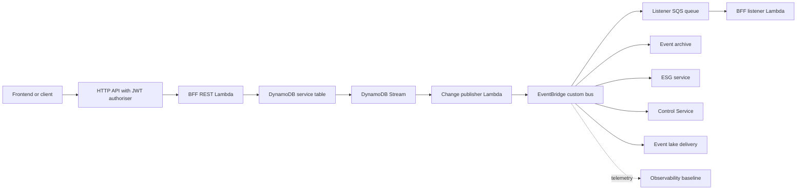
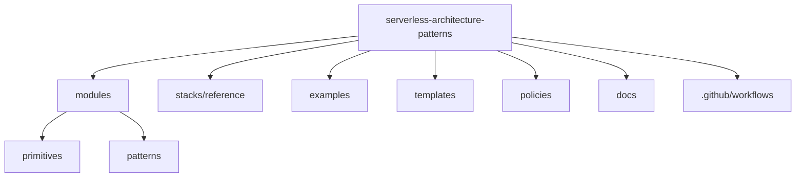

# Architecture Overview

This repository provides Terraform modules, reference stacks, scaffolds, tests, policies, and diagrams for building autonomous serverless subsystems on AWS. It is designed to stand on its own: a contributor should be able to understand the patterns from this documentation and the module READMEs without needing any external source material.

An autonomous subsystem owns a business capability, its data, its deployment boundary, and its operational controls. Other systems interact with it through APIs and events rather than shared databases or copied application code. The patterns in this repository help teams keep those boundaries clear while still supporting frontend delivery, external integrations, orchestration, analytics, observability, and governance.

## Pattern Catalogue

This is the one-line summary. For a detailed page per pattern (what it builds, how it works, its inputs and outputs, and when to use it), see the [pattern reference](../patterns/README.md); for how the composer assembles them into a subsystem, see [Building a subsystem](../building-a-subsystem.md).

| Pattern | Purpose | Use it when |
| --- | --- | --- |
| Primitives | Small reusable Terraform building blocks for Lambda, HTTP APIs, DynamoDB tables, and EventBridge buses. | You need consistent low-level AWS resources with tagging, encryption, logging, and least-privilege defaults. |
| Event hub | A custom EventBridge bus that routes business facts between producers and consumers inside a subsystem boundary. | Multiple services need to collaborate asynchronously without direct service-to-service coupling. |
| BFF service | A Backend for Frontend that owns frontend-specific API composition and read-model updates. | A web or mobile frontend needs a stable API tailored to its workflow rather than a generic internal service API. |
| ESG service | An External Service Gateway that isolates third-party protocols, credentials, retries, and data normalisation. | A subsystem must integrate with SaaS, partner APIs, legacy systems, or external webhooks. |
| Control Service | A policy and orchestration component that reacts to events and publishes decisions. | Business processes span multiple events, require correlation, or need explicit workflow control. |
| Event lake | An immutable analytical store of selected events delivered to S3. | Teams need audit, replay, analytics, or downstream reporting without coupling consumers to live services. |
| Observability baseline | Shared conventions for logs, metrics, traces, dashboards, alarms, and alert topics. | Every service should expose health and failure symptoms consistently from day one. |
| Frontend edge | CloudFront and private S3 delivery for frontend artefacts, with API routing to the BFF. | Static frontend assets and API routes need a secure public edge. |
| Regional health check | Health signals and failover wiring for regional readiness. | A subsystem needs explicit regional availability checks and operator visibility. |
| Fault monitor | Independent collection, alerting, and persistence of operational fault events. | Failures should be observed outside individual service runtimes so one service failure does not hide another. |

## Pattern Relationships

The patterns are intended to compose rather than compete:

- The **BFF service** handles synchronous user intent and owns frontend-facing state.
- The **event hub** carries asynchronous business facts between services.
- The **Control Service** observes events, evaluates policy or workflow state, and emits higher-order decision events.
- The **ESG service** bridges the subsystem to external systems without leaking external concerns into core services.
- The **event lake** receives selected facts for analytics, replay, and audit.
- The **observability baseline** watches the subsystem as an operational product, not just as isolated functions.
- The **frontend edge**, **regional health check**, and **fault monitor** extend the subsystem for delivery, resilience, and operations.

## Subsystem Architecture

Editable draw.io diagrams for the implemented patterns are available in [patterns-clean.drawio](patterns-clean.drawio). The file uses one tab per pattern with AWS-service-labelled shapes and short pattern description notes. Tabs cover the four primitives, every pattern module (event hub, BFF, ESG, control service in both modes, event lake, observability baseline, frontend edge, regional health check, fault monitor, micro-frontend manifest deployer), the two reference stacks (subsystem core and public app), and a worked example: *Online order subsystem*: that composes every module into a recognisable retail-checkout architecture so contributors can see how the building blocks fit together for a real domain.

## Repository Structure

## Security And Operations Defaults

- Tags are required on module inputs and propagated to resources.
- Lambda functions use one execution role per function.
- DynamoDB, queues, logs, and event buses use customer managed KMS encryption by default unless callers pass an existing key.
- Log retention is finite by default.
- Async and event routes use DLQs where the service supports them.
- Secrets are referenced through SSM Parameter Store or Secrets Manager ARNs, never inlined.
- Child modules declare required providers only; provider configuration and aliases live in root stacks and examples.
