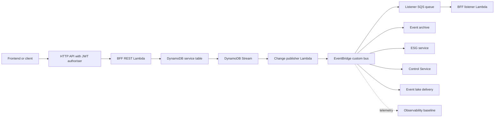
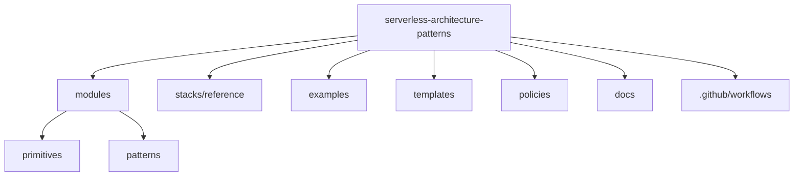

# Architecture Overview

This library builds **autonomous subsystems**: the architecture from *Software Architecture Patterns for Serverless Systems*, the book this repository implements. This overview explains what that means and how the pieces fit together. It stands on its own, so you do not need the book to use the library.

A large system is hard to change because everything depends on everything else. The remedy is to split it into subsystems, where each subsystem owns one business capability (ordering, payments, fulfilment) from end to end: its APIs, its functions, its data, its deployment, and its monitoring. One team builds and runs it without waiting on anyone else.

A subsystem is *autonomous* because of how it talks to the rest of the system: only through events, never by reaching into another subsystem's database or calling its API directly. It publishes facts about what happened and reacts to facts published by others. Because nothing crosses a boundary synchronously, one subsystem being slow or down cannot stall the rest, and a mistake stays contained to where it was made. Those boundaries act as bulkheads, and they are what let teams move quickly without breaking each other.

## Pattern Catalogue

This is the one-line summary. For a detailed page per pattern (what it builds, how it works, its inputs and outputs, and when to use it), see the [pattern reference](../patterns/README.md); for how the composer assembles them into a subsystem, see [Building a subsystem](../building-a-subsystem.md).

| Pattern | Purpose | Use it when |
| --- | --- | --- |
| Primitives | Small reusable Terraform building blocks for Lambda, HTTP APIs, DynamoDB tables, and EventBridge buses. | You need consistent low-level AWS resources with tagging, encryption, logging, and least-privilege defaults. |
| Event hub | A custom EventBridge bus that routes business facts between producers and consumers inside a subsystem boundary. | Multiple services need to collaborate asynchronously without direct service-to-service coupling. |
| BFF service | A Backend for Frontend that owns frontend-specific API composition and read-model updates. | A web or mobile frontend needs a stable API tailored to its workflow rather than a generic internal service API. |
| ESG service | An External Service Gateway that isolates third-party protocols, credentials, retries, and data normalisation. | A subsystem must integrate with SaaS, partner APIs, legacy systems, or external webhooks. |
| Control Service | A policy and orchestration component that reacts to events and publishes decisions. | Business processes span multiple events, require correlation, or need explicit workflow control. |
| Event lake | An immutable analytical store of selected events delivered to S3. | Teams need audit, replay, analytics, or downstream reporting without coupling consumers to live services. |
| Observability baseline | Shared conventions for logs, metrics, traces, dashboards, alarms, and alert topics. | Every service should expose health and failure symptoms consistently from day one. |
| Frontend edge | CloudFront and private S3 delivery for frontend artefacts, with API routing to the BFF. | Static frontend assets and API routes need a secure public edge. |
| Regional health check | Health signals and failover wiring for regional readiness. | A subsystem needs explicit regional availability checks and operator visibility. |
| Fault monitor | Independent collection, alerting, and persistence of operational fault events. | Failures should be observed outside individual service runtimes so one service failure does not hide another. |

## How a subsystem fits together

The rule that separates subsystems also shapes the inside of one: its services do not call each other either. They collaborate through a private **event hub** (a custom EventBridge bus). A service writes to its own data, publishes a fact, and moves on; the services that care about that fact subscribe to it and keep their own copy. No service reads another's database or waits on another's API.

Three patterns do the work of a subsystem:

- A **BFF service** backs one user activity, such as checkout or account management. It owns an HTTP API and a database, and turns user actions into facts on the hub.
- A **control service** reacts to facts to make a decision or run a multi-step process, then publishes the facts that result. It is where logic that spans several services lives.
- An **ESG service** is the gateway to anything outside the subsystem: a payment provider, a partner API, or another subsystem. It translates the outside world into the subsystem's own facts, and outbound facts into external calls, so external quirks never leak inward.

Three more patterns watch and remember the whole subsystem: the **event lake** keeps an immutable history of every fact for audit and replay, the **observability baseline** alarms on every function and queue, and the **fault monitor** captures failures so they can be investigated and resubmitted.

Inside a subsystem, a single fact flows like this:

Every pattern has its own AWS-labelled, editable tab in [`patterns-clean.drawio`](patterns-clean.drawio), which also includes two end-to-end worked examples: an online order subsystem and a payments payout process. For a detailed page on each pattern, see the [pattern reference](../patterns/README.md).

## Repository Structure

## Security And Operations Defaults

- Tags are required on module inputs and propagated to resources.
- Lambda functions use one execution role per function.
- DynamoDB, queues, logs, and event buses use customer managed KMS encryption by default unless callers pass an existing key.
- Log retention is finite by default.
- Async and event routes use DLQs where the service supports them.
- Secrets are referenced through SSM Parameter Store or Secrets Manager ARNs, never inlined.
- Child modules declare required providers only; provider configuration and aliases live in root stacks and examples.
