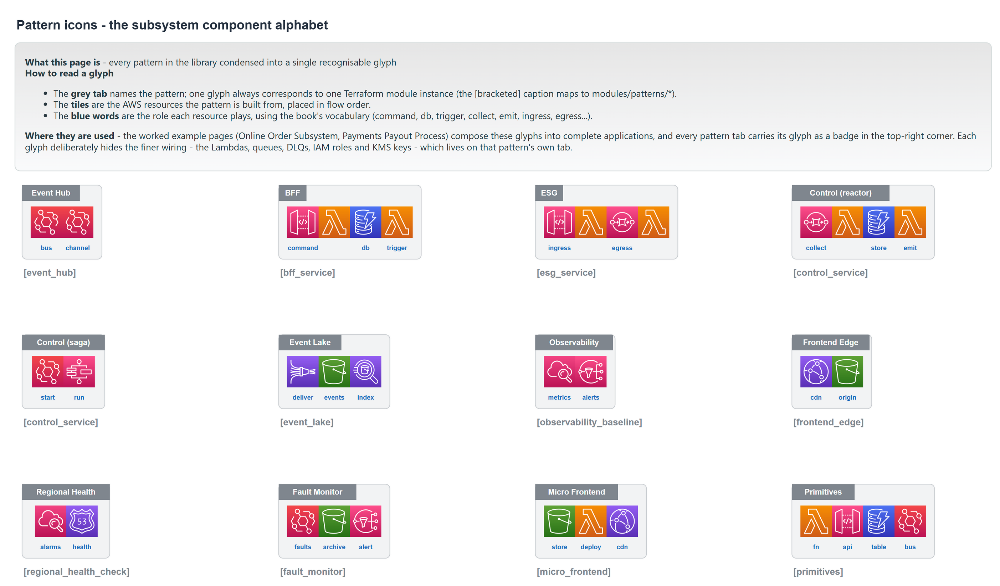
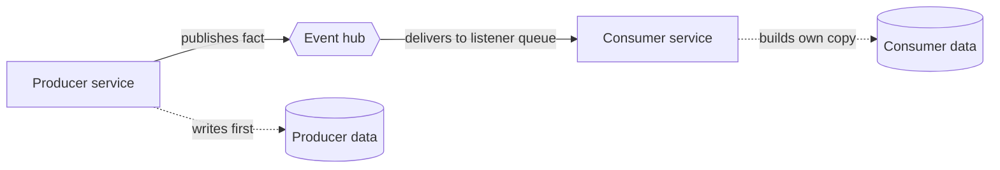

# Pattern reference

This library builds **autonomous subsystems**. A subsystem owns one business capability (ordering, payments, fulfilment) from end to end: its APIs, its functions, its data, its deployment, and its monitoring. It is *autonomous* because it talks to the rest of the system only through events, never by reaching into another subsystem's database or calling its API. Because nothing crosses that boundary synchronously, one subsystem being slow or down cannot stall the others, and a mistake stays contained to where it was made.

This reference covers the building blocks those subsystems are made of, one page per pattern, each written against the module code. For how the patterns assemble into a whole subsystem, see [Building a subsystem](../building-a-subsystem.md).

Every pattern has a glyph in that key, and each detailed page below embeds the matching tab from the architecture diagram.

## The three layers

The library is organised in three layers. Each layer is usable on its own, and each higher layer is built from the one below it.

1. **Primitives** (`modules/primitives/`) wrap a single AWS resource and apply the library's security defaults. There are four: a Lambda function, an HTTP API, a DynamoDB table, and an EventBridge bus. You rarely call these directly; the patterns call them for you.
2. **Patterns** (`modules/patterns/`) are the named building blocks of an autonomous subsystem. Each one is a complete concern (a user-facing service, a gateway to an external system, the event bus itself, the audit archive) composed from primitives and the wiring between them. There are ten.
3. **Composition** (`modules/composition/subsystem`) takes a single declarative manifest and instantiates the patterns, then derives the cross-pattern wiring that no individual pattern can own: the shared encryption key, the hub routes, the queue policies that let the bus deliver into each service, and the monitoring inputs. This is the layer the two worked examples and the app template use.

## The patterns

Every pattern is composed from the four primitives and exchanges information with the rest of the subsystem only through the event hub. No pattern calls another pattern's API directly.

| Pattern | What it is | Page | Module |
| --- | --- | --- | --- |
| Event hub | The custom EventBridge bus every service publishes facts to and subscribes from. | [event-hub.md](event-hub.md) | [`event_hub`](../../modules/patterns/event_hub) |
| BFF service | A backend for one user activity: an HTTP API, its functions, and its own table. | [bff-service.md](bff-service.md) | [`bff_service`](../../modules/patterns/bff_service) |
| Control service | A service that reacts to events: an event reactor, or a Step Functions saga. | [control-service.md](control-service.md) | [`control_service`](../../modules/patterns/control_service) |
| ESG service | A gateway that isolates an external system behind the subsystem's own events. | [esg-service.md](esg-service.md) | [`esg_service`](../../modules/patterns/esg_service) |
| Event lake | An immutable, replayable S3 archive of the facts the subsystem publishes. | [event-lake.md](event-lake.md) | [`event_lake`](../../modules/patterns/event_lake) |
| Observability baseline | The alarms, dashboard, and alert topic that watch every function and queue. | [observability-baseline.md](observability-baseline.md) | [`observability_baseline`](../../modules/patterns/observability_baseline) |
| Fault monitor | An independent capture, archive, and alert path for fault events. | [fault-monitor.md](fault-monitor.md) | [`fault_monitor`](../../modules/patterns/fault_monitor) |
| Regional health check | A Route 53 health signal aggregated from the subsystem's own alarms. | [regional-health-check.md](regional-health-check.md) | [`regional_health_check`](../../modules/patterns/regional_health_check) |
| Frontend edge | CloudFront over a private S3 origin, with optional API and failover routing. | [frontend-edge.md](frontend-edge.md) | [`frontend_edge`](../../modules/patterns/frontend_edge) |
| Micro-frontend | A manifest store and deployer that assembles per-app fragments into one import map. | [micro-frontend.md](micro-frontend.md) | [`micro_frontend`](../../modules/patterns/micro_frontend) |

The four primitives are documented together in [primitives.md](primitives.md).

## How services collaborate

One rule shapes every pattern: **services do not call each other.** A producer writes to its own data store and publishes a fact to the event hub. A consumer subscribes to the facts it cares about and builds its own copy of whatever it needs. Nothing reaches across a service boundary to read another service's database or invoke another service's function.

This is what makes a subsystem autonomous. A slow or failed service cannot block the services that depend on it, because they depend on its past events, not its live availability. The cost is eventual consistency: a consumer's view of a fact lags the producer by the time it takes an event to travel through the hub.

## Guarantees every pattern applies

These defaults are enforced in every module, so the individual pages do not repeat them. They are validated in the module contract tests and the policy gate.

- **Customer-managed KMS encryption** on every queue, table, topic, bucket, log group, and event bus. A pattern either creates its own key or accepts one from the composition (see the note on `create_kms_key` below).
- **One IAM execution role per Lambda.** Roles are never shared between functions. Each role grants only the actions that function needs.
- **Finite log retention.** Log groups have an explicit retention period. Unlimited retention (0 days) is rejected by input validation.
- **Dead-letter queues on every asynchronous path.** Every EventBridge rule target has a `dead_letter_config`, and every SQS queue that feeds a Lambda has a redrive policy to its own DLQ.
- **Required tags.** `Environment`, `System`, and `Owner` are mandatory inputs and are propagated to every resource. A missing tag fails validation.
- **Secrets by reference.** Modules accept Secrets Manager and SSM Parameter Store ARNs and grant read access to them. Secret values are never passed as input or inlined.

### The `create_kms_key` switch

Every pattern that encrypts data takes a `create_kms_key` flag (default `true`) and a `kms_key_arn` (default `null`). On its own, a pattern creates its own key. Inside a composition, the composer creates one key for the whole subsystem and hands it to every pattern (`create_kms_key = false`, `kms_key_arn` set), so the subsystem shares a single key. Either way, a precondition stops a resource from ever being created without one.

## Next

Once the building blocks make sense, read [Building a subsystem](../building-a-subsystem.md) for how the composer turns a single `subsystem.yaml` into a wired set of these patterns, walked through the online-order and payouts examples.

For the visual companion, open the **Pattern Icons** page of [`patterns-clean.drawio`](../architecture/patterns-clean.drawio); it has one tab per pattern and two worked examples.
