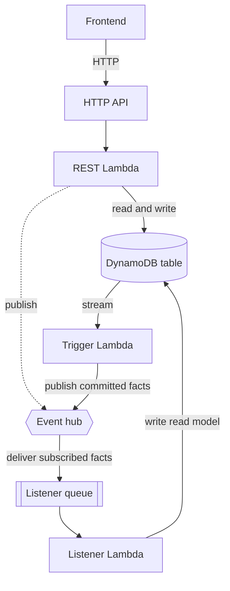

# BFF service

A BFF (backend for frontend) is the service behind one user activity. It owns an HTTP API, the functions that serve it, and its own DynamoDB table. It publishes its changes as events, and it can build a local read model from events other services publish.

Module: [`bff_service`](../../modules/patterns/bff_service).

## The problem it solves

A user activity (checkout, account management, order tracking) needs an API shaped for that activity, and it needs to own its data so it is not coupled to anyone else's database. A BFF is that boundary. It does three things: it serves synchronous requests from the frontend, it publishes the facts that result from those requests, and it keeps its own copy of any external facts it needs so it never has to call another service to read them.

"One BFF per activity" is the intended granularity. Checkout and account are separate BFFs, each with its own API, functions, and table, not two endpoints on one shared service.

## What it builds

A BFF wires three Lambda functions, one table, two queues, and an API into the three data paths below. All Lambdas, the table, and the queues are encrypted with the subsystem key.

- **A DynamoDB table** (via the [`dynamodb_table`](../../modules/primitives/dynamodb_table) primitive) with its stream enabled. This is the service's own data.
- **A REST Lambda** (`<name>-rest`) behind the API. It reads and writes the table and can publish events (`events:PutEvents` on the bus). This serves the synchronous request path.
- **A trigger Lambda** (`<name>-trigger`) on the table's stream. It turns committed writes into published events. This is the database-first publication path: an event is only published once the write it describes is durable.
- **A listener Lambda** (`<name>-listener`) on an SQS queue. It consumes events the hub delivers and writes the result into the table. This is the read-model path.
- **An HTTP API** (via the [`api_http`](../../modules/primitives/api_http) primitive) with optional JWT authorisation, routing `ANY /{proxy+}` and `ANY /` to the REST Lambda.
- **A listener queue** (`<name>-listener`) with a redrive policy to its DLQ (`<name>-listener-dlq`), and a **trigger DLQ** (`<name>-trigger-dlq`) used as the on-failure destination for the stream.
- **Two event source mappings**: SQS to the listener Lambda (batch 10, partial-batch reporting), and the table stream to the trigger Lambda (from `TRIM_HORIZON`, batch 100, partial-batch reporting, on-failure to the trigger DLQ).

## How it works



The three paths are independent:

1. **Request path.** The frontend calls the API; the REST Lambda reads or writes the table and returns. It may publish an event inline, but the durable way to publish is the next path.
2. **Publication path.** A write to the table produces a stream record; the trigger Lambda reads the stream and publishes the corresponding fact to the hub. Because publication is driven by the committed stream, an event is never published for a write that did not commit. Failed stream batches go to the trigger DLQ.
3. **Read-model path.** Facts the BFF subscribes to arrive on the listener queue; the listener Lambda writes them into the table so the BFF has a local copy. The BFF never calls the producing service to read those facts.

## A deliberate gap: the listener queue policy

The BFF creates its listener queue but **does not** attach the SQS policy that lets EventBridge deliver into it. That policy must name the exact hub rule ARN, and the BFF has no knowledge of the hub. The composition owns that glue and attaches it (see [Building a subsystem](../building-a-subsystem.md#listener-queue-policies)). The `listener_queue_url`, `listener_queue_name`, and `listener_queue_arn` outputs exist for that purpose.

## Inputs that matter

- `name`, `event_bus_name`, `event_bus_arn`, `artefacts`, `table`, and `tags` are required. `artefacts` supplies the zip location for each of the three functions; `table` needs at least a name (keys default to `pk`/`sk`).
- `jwt_authorizer` (`{ issuer, audience }`) protects the API at the gateway. Without it the API is open at the infrastructure layer and the REST function must verify tokens itself.
- `cors_allow_origins` sets CORS for the API.
- `stream_max_retry_attempts`, `max_receive_count`, and the retention inputs tune the failure behaviour of the stream and queue paths.

## Outputs

`api_endpoint`, `api_domain_name`, `api_id`, `table_name`, `table_arn`, the listener queue identifiers, the listener and trigger DLQ names (for monitoring), `lambda_function_names` (the three functions), and `timeout_seconds` (fed to the observability duration alarm).

## In a manifest

```yaml
bffs:
  - name: cart
    path: /cart/*
    publishes: [OrderPlaced]
  - name: tracking
    path: /tracking/*
    read_only: true
    subscribes: [OrderPlaced, ShipmentRequested]
```

`subscribes` is what drives the read-model path: the composer creates a hub route for each subscribing BFF and the queue policy that lets the hub deliver into it. `path` is surfaced so the frontend edge can route to this BFF. `publishes` and `read_only` are documentation; they describe intent but do not change what is built.

## When to use it

Use a BFF for any activity a user (or a frontend on a user's behalf) drives synchronously and that owns data. Use one per activity. Do not use a BFF for work that has no synchronous caller and no API: that is a [control service](control-service.md). Do not use a BFF as the entry point for an external system's callbacks: that is an [ESG service](esg-service.md).

## Diagram

The **BFF** tab of [`patterns-clean.drawio`](../architecture/patterns-clean.drawio) shows the API, the three Lambdas, the table and its stream, and the listener queue.

---

[Back to the pattern reference](README.md)
