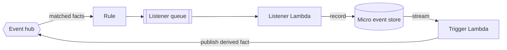
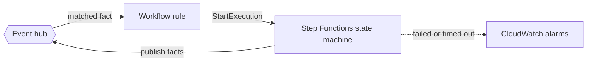
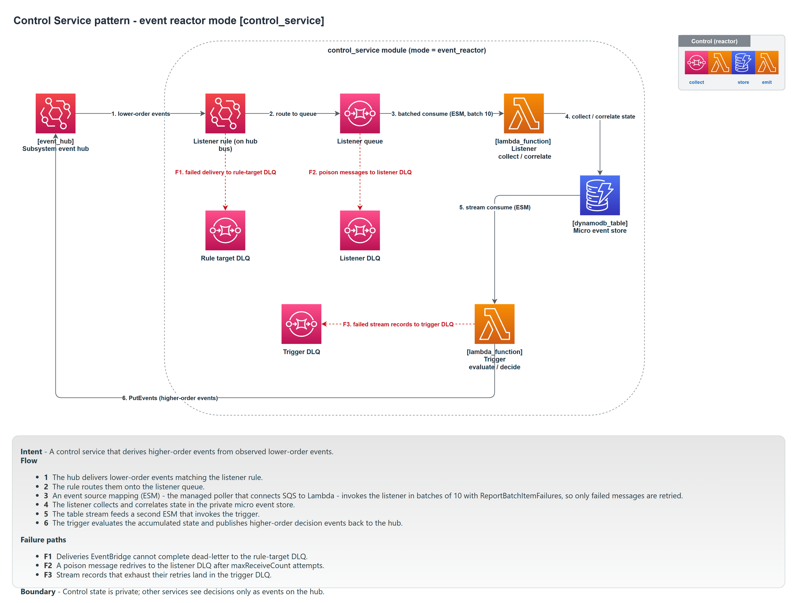
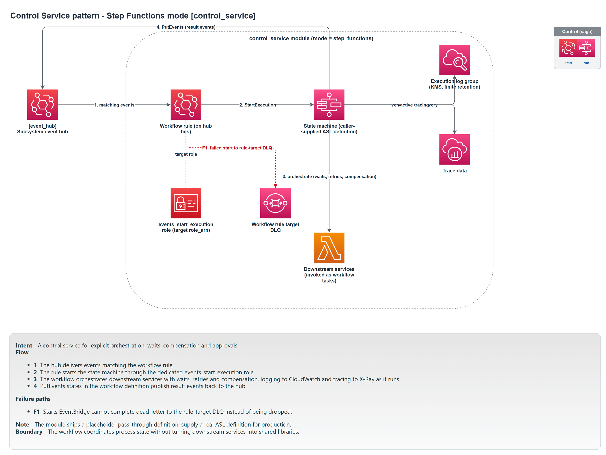

# Control service

A control service reacts to events. It has no user-facing API. It observes facts on the hub, applies logic, and either emits a new, higher-order fact or runs a multi-step process. It comes in two modes, and you choose one per service.

Module: [`control_service`](../../modules/patterns/control_service).

## The problem it solves

Some logic does not belong to any single user activity. "When a payout is requested, screen it for compliance before it is approved" is not part of the initiation BFF or the tracking BFF; it is a decision the subsystem makes in response to events. A control service is where that logic lives. It keeps decision-making out of the BFFs (which stay focused on their activity) and off the producing service (which should not know who reacts to its facts).

The two modes cover two shapes of reaction:

- **Event reactor** for "derive a new fact from observed facts." Stateless-ish, single-step: observe, decide, emit.
- **Step Functions saga** for "run a process with several steps, waits, retries, and compensation." Stateful, multi-step, long-running.

`mode` is validated to be exactly one of these, and every resource is gated on the chosen mode, so a control service is one shape or the other, never both.

## Event reactor mode

### What it builds

- **A micro event store** (a DynamoDB table, default `<name>-events`, keys `pk`/`sk`) with its stream enabled. The reactor records what it has observed and decided here.
- **A listener queue** (`<name>-listener`) with a redrive policy to `<name>-listener-dlq`, fed by an **EventBridge rule** (`<name>-listener`) whose target is that queue. The rule's target has a dead-letter queue (`<name>-listener-rule-dlq`), and the module attaches the SQS policy that lets EventBridge deliver into the listener queue.
- **A listener Lambda** (`<name>-listener`) on the queue. It writes observed facts into the micro event store.
- **A trigger Lambda** (`<name>-trigger`) on the store's stream. It publishes the higher-order facts the reactor decides on (`events:PutEvents`). Failed stream batches go to `<name>-trigger-dlq`.

### How it works



The shape mirrors a BFF's publication path, but the input is the hub rather than an HTTP API, and the table is an internal record of observations rather than user-facing data. Unlike a BFF, the reactor wires its own listener queue policy, because it owns the rule that delivers into it.

## Step Functions mode

### What it builds

- **A state machine** (`aws_sfn_state_machine.this`, type `STANDARD` by default) running your ASL definition, with X-Ray tracing on and execution logging to `/aws/vendedlogs/states/<name>`.
- **Two IAM roles**: the state machine's own role (granted `events:PutEvents`, log delivery, and key use), and an EventBridge role (`<name>-events-start`) that may only `states:StartExecution`.
- **An EventBridge rule** (`<name>-workflow`) whose target is the state machine, started through that EventBridge role, with a dead-letter queue (`<name>-workflow-rule-dlq`) for failed starts.
- **Two CloudWatch alarms**, on `ExecutionsFailed` and `ExecutionsTimedOut`, both firing `alarm_actions` when greater than zero.

### How it works



A matched fact starts an execution. The state machine runs your steps (calls, waits, choices, compensation) and publishes facts back to the hub as it progresses. If you do not supply a definition, the module installs a no-op placeholder that immediately succeeds, so the infrastructure is valid before the real workflow is written; you replace `state_machine_definition` before the saga does anything.

## Inputs that matter

- `name`, `event_bus_name`, `event_bus_arn`, `event_pattern`, and `tags` are required. `event_pattern` is the EventBridge pattern selecting the facts this service reacts to.
- `mode` selects the shape (`event_reactor` or `step_functions`).
- Event reactor: `artefacts.listener` and `artefacts.trigger` supply the two functions; `table_name` overrides the store name.
- Step Functions: `state_machine_definition` is the ASL; `workflow_type` (`STANDARD` or `EXPRESS`), the logging inputs, and `alarm_actions` tune execution.

## Outputs

`mode`, and then mode-specific values that are null in the other mode: `table_name`, the listener and trigger queue and DLQ identifiers, and `lambda_function_names` for a reactor; `state_machine_arn` and `workflow_rule_dlq` identifiers for a saga. `timeout_seconds` feeds the observability duration alarm.

## In a manifest

```yaml
controls:
  - name: compliance-screening
    mode: event_reactor
    subscribes: [PayoutRequested]
  - name: execution-saga
    mode: step_functions
    subscribes: [PayoutApproved]
```

`subscribes` becomes the control service's `event_pattern` (matching those detail-types). For a saga, the composer expects a `state_machine_definition` in the manifest; for a reactor it expects the two artefacts (or relies on `artefact_defaults`). The schema forbids supplying artefacts to a `step_functions` control.

## When to use it

Use an event reactor when one fact (or a small combination) should produce another fact, with no human and no API in the loop: "approved triggers fulfilment", "five failed logins triggers a lockout fact". Use a Step Functions saga when the reaction is a process: ordered steps, waiting for an external result, retrying, and compensating on failure. If the work needs a synchronous API, it is a [BFF](bff-service.md), not a control service.

## Diagram

Event reactor mode:



Step Functions mode:



These are the two **Control Service** tabs of [`patterns-clean.drawio`](../architecture/patterns-clean.drawio); open the source for the editable, zoomable version.

---

[Back to the pattern reference](README.md)
