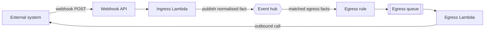
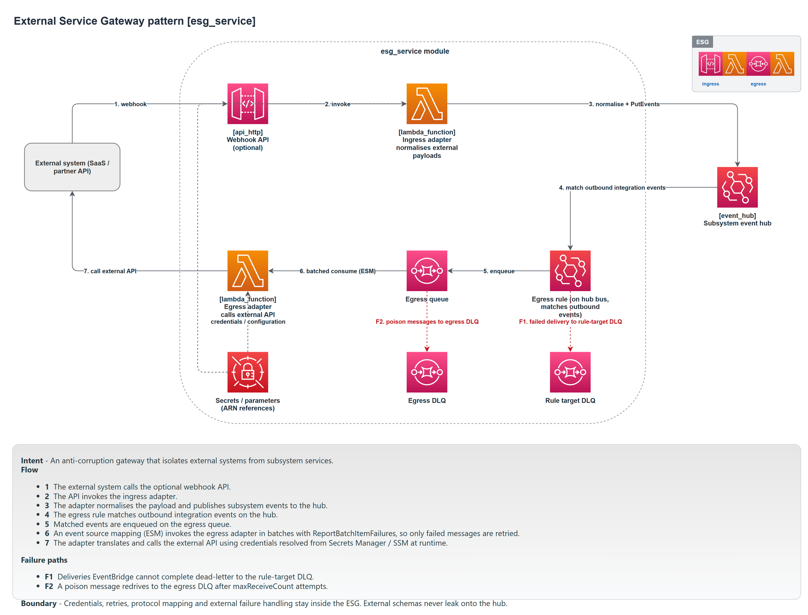

# ESG service

An ESG (external service gateway) is the boundary between the subsystem and an external system: a payment provider, a partner API, a legacy platform. It turns the outside world's protocols, credentials, and data shapes into the subsystem's own events, and it turns the subsystem's events into outbound calls. No other service talks to the external system; they all talk to its facts.

Module: [`esg_service`](../../modules/patterns/esg_service).

## The problem it solves

External systems have their own data models, authentication, retry behaviour, and failure modes. If those leak into the services that use them, every service ends up coupled to a third party's quirks, and a change at the provider ripples across the subsystem. An ESG contains all of that in one place. Internally, services only ever see clean subsystem events. The provider's webhook format, its API contract, and its credentials live behind the gateway and nowhere else. This is the anti-corruption layer applied to infrastructure.

A gateway has up to two directions, and you can have either or both:

- **Ingress**: the external system sends to us (a webhook, a callback). The gateway receives it, normalises it, and publishes a subsystem event.
- **Egress**: the subsystem needs to call out. The gateway subscribes to the relevant facts and makes the outbound calls.

## What it builds

### Ingress (always present)

- **An ingress Lambda** (`<name>-ingress`) granted `events:PutEvents`. It normalises inbound calls and publishes the resulting fact onto the hub.
- **A webhook API** (via the [`api_http`](../../modules/primitives/api_http) primitive, `POST /webhook`), created by default (`create_webhook_api = true`), optionally protected by a JWT authoriser. This is the externally reachable entry point that invokes the ingress Lambda. The gateway can read provider credentials from `secret_arns` and `parameter_arns`.

### Egress (optional)

The egress path exists only when `external_event_pattern` is set (the composer sets it when an ESG declares `egress` events). When it is absent, the gateway is ingress-only and none of the following are created.

- **An egress queue** (`<name>-egress`) with a redrive policy to `<name>-egress-dlq`.
- **An EventBridge rule** (`<name>-egress`) matching the egress event pattern, with its target being the egress queue, a rule dead-letter queue (`<name>-egress-rule-dlq`), and the SQS policy that lets EventBridge deliver into the queue.
- **An egress Lambda** (`<name>-egress`) on the queue, which makes the outbound calls to the external system.

## How it works



Inbound: the external system calls the webhook, the ingress Lambda translates the payload into a subsystem fact and publishes it, and consumers react as if it came from inside. Outbound: the subsystem publishes a fact the gateway subscribes to, EventBridge queues it, and the egress Lambda makes the call. Both directions are decoupled by a queue, so the external system's latency or downtime is absorbed rather than propagated.

## Ingress-only gateways

A gateway that only receives (a provider that posts status callbacks but takes no calls from us) declares no egress events. The egress queue, rule, Lambda, and DLQs are not created, and a precondition requires the webhook API to be enabled, because an ingress-only gateway with no webhook would have no way to interact with the external system at all. Model a "receive callbacks" integration as an ingress-only ESG, never as a [BFF](bff-service.md) (there is no user activity) and never with a fabricated egress event.

## Inputs

- `name`, `event_bus_name`, `event_bus_arn`, `artefacts`, and `tags` are required. `artefacts.ingress` is always needed; `artefacts.egress` is required only when the egress path is enabled (a precondition enforces this).
- `external_event_pattern` (default `null`) enables egress when set. The composer sets it from the manifest's `egress` events.
- `create_webhook_api` (default `true`), `jwt_authorizer`, `secret_arns`, and `parameter_arns` configure the inbound side and credential access.

## Outputs

`ingress_function_name` (always present), `webhook_api_endpoint`, and a set of egress identifiers (`egress_function_name`, `egress_queue_arn`, the egress DLQ and rule DLQ names) that are null on an ingress-only gateway. `timeout_seconds` feeds the observability duration alarm.

## In a manifest

```yaml
esgs:
  # Two-way gateway: receives webhooks and makes outbound calls.
  - name: banking-rails
    external: partner-bank
    egress: [TransferInstructed]
    webhook: true

  # Ingress-only gateway: receives provider callbacks, no outbound path.
  - name: psp-webhook
    external: payment-provider
    webhook: true
```

The schema requires each ESG to have either an `egress` list or `webhook: true`; a gateway with neither is rejected, because it could do nothing. `external` is documentation. The composer derives the egress event pattern from the `egress` list and leaves it unset (ingress-only) when there is no list.

## When to use it

Use an ESG for every external system the subsystem integrates with: one gateway per external system. Use ingress-only when the provider only calls you, two-way when you also call the provider. Do not let any other service hold the provider's credentials or know its API; route everything through the gateway's events.

## Diagram



This is the **ESG Service** tab of [`patterns-clean.drawio`](../architecture/patterns-clean.drawio); open the source for the editable, zoomable version.

---

[Back to the pattern reference](README.md)
