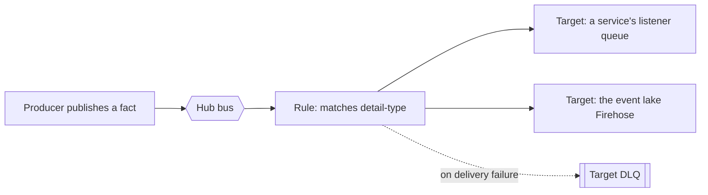
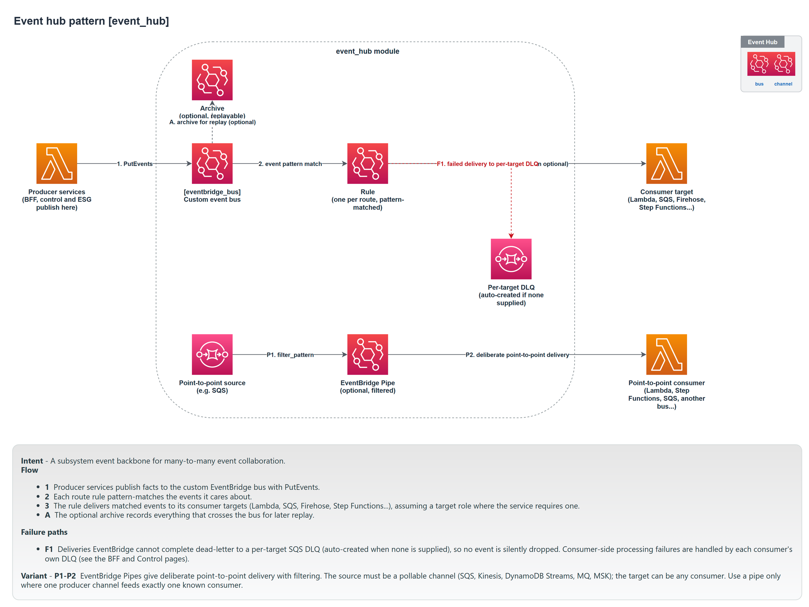

# Event hub

The event hub is the custom EventBridge bus at the centre of a subsystem. Every service publishes its facts to the hub and subscribes to the facts it needs from it. It is the only thing every other pattern touches, and it is the reason services never call each other directly.

Module: [`event_hub`](../../modules/patterns/event_hub).

## The problem it solves

If services call each other directly, the caller is coupled to the callee's availability, location, and interface. One slow service slows everyone upstream of it; one failed service fails them. A shared bus removes that coupling. A producer publishes a fact and moves on. Consumers receive the fact asynchronously and react in their own time. The producer does not know who is listening, and a consumer being down does not affect the producer.

EventBridge is a managed bus, so the hub is a thin, declarative layer over it: a named bus, a set of routing rules, the dead-letter queues that catch failed deliveries, and an optional archive for replay.

## What it builds

- **The bus** (via the [`eventbridge_bus`](../../modules/primitives/eventbridge_bus) primitive), named after the hub, encrypted with the subsystem key, with an optional archive controlled by `archive_enabled` and `archive_retention_days`.
- **One EventBridge rule per route** (`aws_cloudwatch_event_rule.route`, one per entry in `routes`). A rule has an event pattern (which facts it matches) and an enabled or disabled state.
- **One target per (route, target) pair** (`aws_cloudwatch_event_target.route`). A single rule can fan out to several targets. Every target carries a `dead_letter_config`.
- **One dead-letter queue per target that opts in** (`aws_sqs_queue.target_dlq`), encrypted with the subsystem key. A target either uses a DLQ the hub creates for it (the default) or an external DLQ ARN you supply.
- **Optional EventBridge Pipes** (`aws_pipes_pipe.this`, one per entry in `pipes`) for point-to-point movement from a source to a target, with an optional filter. Use a pipe when a full bus route adds nothing, for example moving records straight from a stream to a queue.

The hub does not create IAM roles, queue policies, or publish permissions. Granting a service permission to publish, and granting EventBridge permission to deliver into a service's queue, are the caller's responsibility. The composition layer does this; see [Building a subsystem](../building-a-subsystem.md).

## How it works

A route is a rule plus its targets. The module flattens `routes` into one entry per target, so a rule can match a class of facts and deliver each match to several destinations at once.



When EventBridge cannot deliver to a target (the destination is unreachable, or rejects the message), the event goes to that target's dead-letter queue rather than being lost. A depth alarm on those DLQs is how a subsystem learns that deliveries are failing; the composition wires those alarms automatically.

## Inputs that matter

- `name` and `tags` are required.
- `routes` is a map. Each route is `{ event_pattern, description?, enabled?, targets[] }`, and each target is `{ id, arn, role_arn?, input_path?, dead_letter_queue_arn?, create_dead_letter_queue? }`. The event pattern is standard EventBridge JSON; the most common form matches on `detail-type`.
- `archive_enabled` (default `true`) and `archive_retention_days` (default `30`) control replay.
- `pipes` is a map of point-to-point pipes, each `{ source_arn, target_arn, role_arn, filter_pattern?, desired_state? }`.

## Outputs

`bus_name`, `bus_arn`, `archive_arn`, `rule_names` (a map of route key to created rule name), and `pipe_arns`.

`rule_names` matters to the composition: queue policies that authorise EventBridge to deliver into a service must reference the exact rule ARN, and the composer checks its predicted names against this output.

## In a manifest

You do not configure routes by hand when using the composer. The manifest's `hub` block controls only the archive:

```yaml
hub:
  archive: true
  archive_retention_days: 30
```

The composer derives the routes from what each service subscribes to and from whether the event lake is enabled. A BFF that `subscribes` to `OrderPlaced` becomes a rule matching `OrderPlaced` with that BFF's listener queue as the target. See [Building a subsystem](../building-a-subsystem.md#hub-routes).

## When to use it

Always. The event hub is the one mandatory pattern. A subsystem with a single service still has a hub, because the hub is also how the event lake, the fault monitor, and external gateways receive facts. The composer always creates exactly one.

## Diagram



This is the **Event Hub** tab of [`patterns-clean.drawio`](../architecture/patterns-clean.drawio); open the source for the editable, zoomable version.

---

[Back to the pattern reference](README.md)
