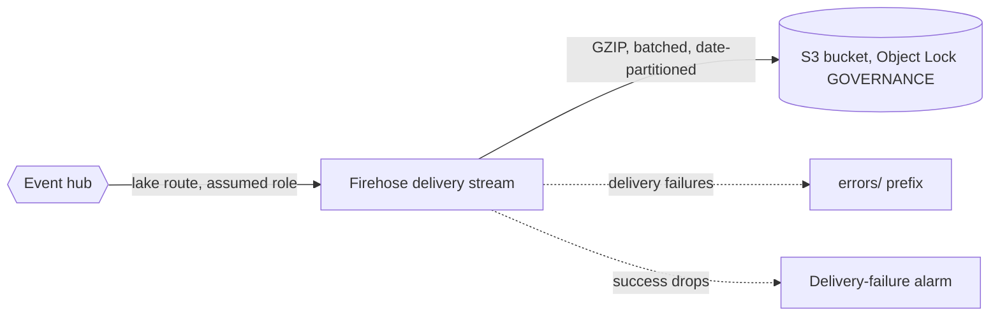
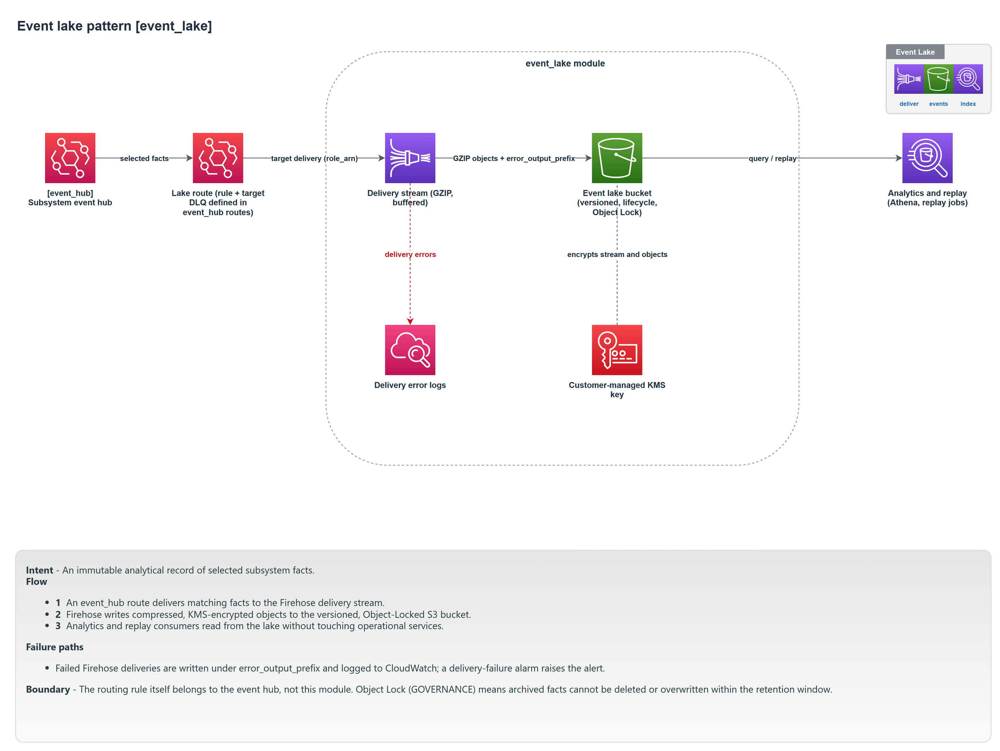

# Event lake

The event lake is an immutable, append-only archive of the facts a subsystem publishes, stored in S3. It is the subsystem's long-term memory: an audit trail, a source for analytics, and the data you replay when you need to rebuild a read model or investigate the past.

Module: [`event_lake`](../../modules/patterns/event_lake).

## The problem it solves

Events on the bus are transient. Once delivered, they are gone. But the history of what happened (every order placed, every payout requested) is often the most valuable data a subsystem produces: it is what audit, reporting, and recovery all need. The event lake captures selected facts to durable, tamper-resistant storage as they flow, without any consumer being coupled to it. Producers do not know the lake exists; the lake just receives a copy of the facts via a hub route.

## What it builds

- **An S3 bucket** (named after the lake or `bucket_name`) with **Object Lock enabled in `GOVERNANCE` mode**, versioning on, all public access blocked, and customer-managed KMS encryption. Object Lock is what makes the archive immutable: an object cannot be overwritten or deleted within its retention window except by a principal with the explicit governance-bypass permission.
- **A Kinesis Data Firehose delivery stream** writing to that bucket, GZIP-compressed, partitioned by date (`events/yyyy/MM/dd/`), with failures written under an `errors/` prefix. Firehose buffers (5 MB or 300 seconds by default) and writes in batches, which is what makes archival cheap at high event rates.
- **A delivery role** for Firehose (write to the bucket, write its own logs, use the key) and a **KMS-encrypted log group** for delivery diagnostics.
- **A delivery-failure alarm** that fires when Firehose's `DeliveryToS3.Success` average drops below 1 over the evaluation window, so a lake that has stopped receiving is noticed.

The module provisions the sink (Firehose plus the bucket). It does **not** create the EventBridge rule that feeds the Firehose; that route, and the IAM role EventBridge assumes to put records, are wired by the composition. See [Building a subsystem](../building-a-subsystem.md#the-event-lake-route).

## How it works



A hub rule matches the facts to archive and targets the Firehose stream, using a role the composition creates. Firehose buffers and writes compressed, partitioned objects to S3. The bucket's Object Lock and versioning mean those objects are retained for the configured period and cannot be silently altered.

## Inputs that matter

- `name` and `tags` are required.
- `retention_days` (default 2555, about seven years) sets the S3 lifecycle expiry; `0` disables expiry (keep forever). `noncurrent_retention_days` (default 90) expires old versions.
- `object_lock_retention_days` (default 30, minimum 1) is the Object Lock window: how long an object cannot be deleted.
- `prefix` and `error_prefix` control the S3 layout; `buffering_size` and `buffering_interval` tune Firehose batching.
- `alarm_actions` are the targets for the delivery-failure alarm (the composer passes the observability topic).

## Outputs

`bucket_name`, `bucket_arn`, `delivery_stream_name`, `delivery_stream_arn` (the target the composer routes to), and `kms_key_arn`.

## In a manifest

```yaml
operations:
  event_lake:
    enabled: true
    detail_types: [OrderPlaced, OrderShipped]   # omit to archive every fact
    retention_days: 2555
    object_lock_retention_days: 30
```

`enabled` defaults to `true`. By default the lake archives every fact the subsystem publishes; `detail_types` narrows it to a named set. The composer builds the hub route from this: a rule matching either those detail-types or everything, targeting the Firehose.

## When to use it

Enable it for any subsystem where history has value: anything with audit, compliance, reporting, or replay needs (most do). It is on by default. Disable it only for a throwaway subsystem where the event history genuinely does not matter; doing so removes the route and the glue role as well as the bucket.

## Diagram



This is the **Event Lake** tab of [`patterns-clean.drawio`](../architecture/patterns-clean.drawio); open the source for the editable, zoomable version.

---

[Back to the pattern reference](README.md)
