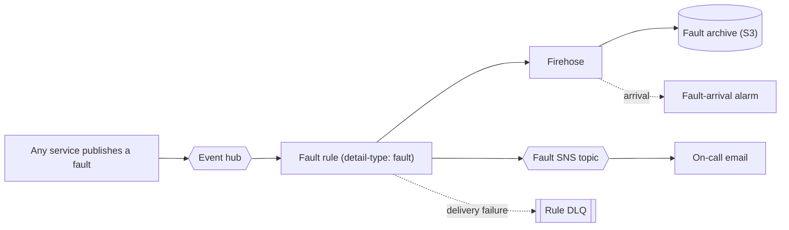
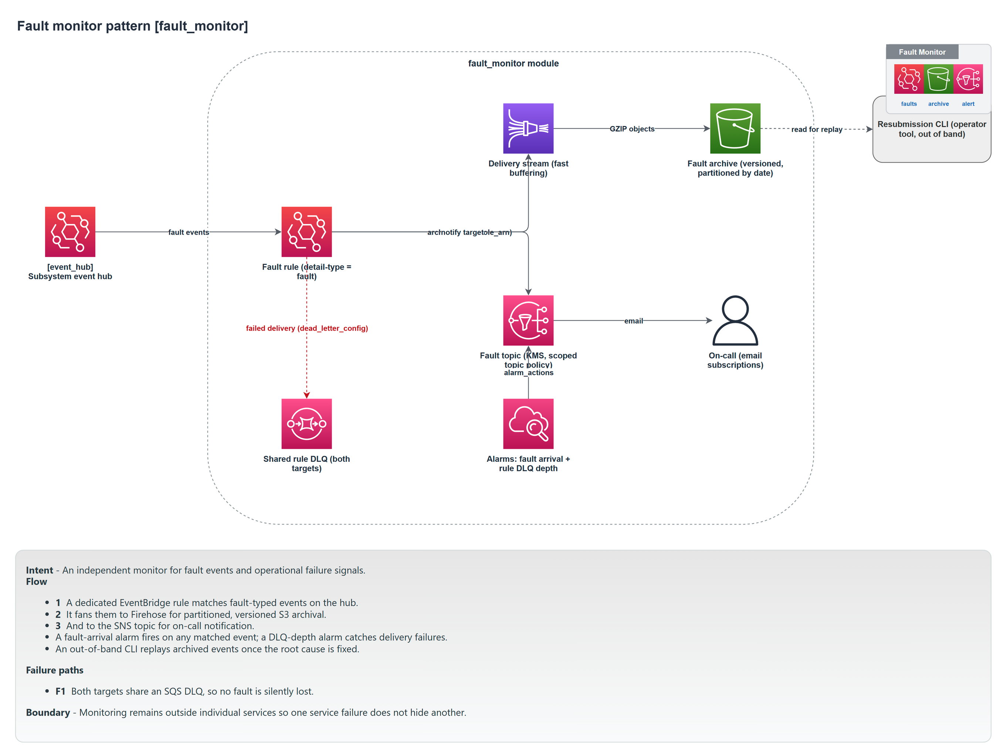

# Fault monitor

The fault monitor is an independent path that captures fault events, archives them for later resubmission, and alerts a human. It is separate from the services that produce the faults, so a service failing cannot also disable the thing that was meant to notice it.

Module: [`fault_monitor`](../../modules/patterns/fault_monitor).

## The problem it solves

When a service hits an unrecoverable error, it should publish a fault event rather than swallow the error or crash silently. But if the handling of those fault events lives inside the same services, a widespread failure takes out the fault handling along with everything else. The fault monitor is deliberately standalone: its own rule on the hub, its own archive, its own alert topic. It does two things with every fault: stores it durably so the work can be resubmitted once the cause is fixed, and pages someone now. This pairs with the resubmission workflow in Chapter 4 of the book.

## What it builds

- **An EventBridge rule** (`<name>-faults`) on the hub. By default it matches events with `detail-type: fault`; `event_pattern` overrides this to match whatever your subsystem uses to signal faults.
- **Two targets on that rule**, each with a dead-letter queue (`<name>-rule-dlq`): a **Kinesis Firehose stream** that archives the fault to S3, and the **SNS fault topic** that alerts.
- **An S3 bucket** (versioned, public access blocked, KMS-encrypted) holding the fault archive, partitioned by time. Unlike the [event lake](event-lake.md), this bucket has no Object Lock: faults are operational data to be acted on and aged out (default 90-day retention), not a permanent immutable record.
- **A Firehose stream and its delivery role**, buffering briefly (60 seconds by default, shorter than the lake) so faults land quickly enough to act on.
- **An SNS topic** (`<name>-faults`) with email subscriptions, and a **topic policy** that explicitly grants two publishers: EventBridge (scoped to the fault rule) and CloudWatch alarms (scoped to this account's alarms). The explicit alarm grant matters: replacing the topic's default policy would otherwise lock out the monitor's own alarms.
- **Two alarms**: fault arrival (any fault matched), and rule-DLQ depth (the Firehose or SNS target became unreachable).

## How it works



A fault published anywhere in the subsystem is matched by the rule and fanned out to both targets at once: archived for resubmission and announced for attention. Failed deliveries to either target land in the rule DLQ, which has its own depth alarm, so the fault monitor cannot fail silently either.

## Inputs

- `name`, `event_bus_name`, `event_bus_arn`, and `tags` are required.
- `event_pattern` (default `null`) overrides the `detail-type: fault` match.
- `notification_emails` are the on-call subscribers; `alarm_actions` adds extra alarm targets.
- `retention_days` (default 90; `0` keeps faults forever), `buffering_interval` (default 60s), and the prefixes control archival.

## Outputs

`bucket_name`, `bucket_arn`, `delivery_stream_arn`, `rule_name`, `rule_dlq_arn`, `fault_topic_arn`, `fault_arrival_alarm_arn`, and `kms_key_arn`.

## In a manifest

```yaml
operations:
  fault_monitor:
    enabled: true
    emails: [oncall@example.com]
```

`enabled` defaults to `true`. The composer wires the monitor onto the subsystem hub and passes the notification emails through. The fault monitor wires its own rule and targets (unlike the event lake, whose route the composer derives), so there is no extra composition glue for it beyond the shared key.

## When to use it

Enable it for any subsystem that runs unattended (most do); it is on by default. It is only useful if your services actually publish fault events on unrecoverable errors, so adopt that convention alongside it. Disable it only where there is no on-call and no resubmission story.

## Diagram



This is the **Fault Monitor** tab of [`patterns-clean.drawio`](../architecture/patterns-clean.drawio); open the source for the editable, zoomable version.

---

[Back to the pattern reference](README.md)
