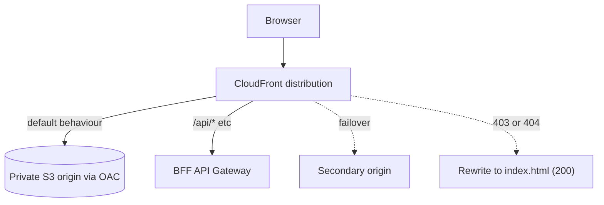

# Frontend edge

The frontend edge is the public entry point for a subsystem's web frontend: a CloudFront distribution over a private S3 origin, with optional API routing to BFFs and optional failover to a second origin. It serves static assets securely and, when configured, puts the frontend and its APIs behind one domain.

Module: [`frontend_edge`](../../modules/patterns/frontend_edge).

## The problem it solves

A web frontend needs a secure public edge: HTTPS, a CDN, locked-down storage, and security headers. It often also needs its API calls served from the same domain as its assets, to avoid cross-origin complexity. The frontend edge provides both. The S3 origin is fully private and reachable only through CloudFront; the distribution adds security headers and HTTPS; and `/api/*`-style paths can be routed to BFF API Gateways so the browser sees one origin.

This is the one pattern that is regional in a specific way: CloudFront and its ACM certificate are global and must be provisioned in `us-east-1`. The library keeps it out of the composer for that reason and deploys it from a separate root.

## What it builds

- **A private S3 origin bucket** (versioned, all public access blocked, KMS-encrypted) reachable only via an **Origin Access Control** (sigv4, always sign). The bucket policy allows only this CloudFront distribution to read, and denies any non-HTTPS access.
- **A CloudFront distribution** with a security-headers response policy (HSTS, frame and content-type options, referrer policy).
- **SPA error rewriting** (on by default): 403 and 404 responses are rewritten to the root object with a 200, so a single-page app's client-side routing works on deep links.
- **Optional API origins** (`api_origins`): each entry adds a custom origin and a cache behaviour that routes a path pattern (for example `/api/*`, `/catalogue/*`) to a BFF API, with caching disabled and the host header stripped. Path patterns must be unique.
- **Optional secondary-origin failover** (`secondary_origin`): adds an origin group so CloudFront fails over to a second origin on the configured status codes.
- **Optional access logging**, and **optional custom domains** (which require an ACM certificate, validated to be in `us-east-1`).

## How it works



The default cache behaviour serves the SPA from the private bucket. Each API origin adds an ordered behaviour that sends its path pattern to a BFF instead. If a secondary origin is configured, the default behaviour targets an origin group and fails over on error.

## Inputs that matter

- `name` and `tags` are required.
- `api_origins` is a map of `{ domain_name, path_pattern, origin_path? }`; path patterns must start with `/` and be unique.
- `secondary_origin`, `failover_status_codes` configure failover.
- `domain_aliases` plus `acm_certificate_arn` (must be `us-east-1`) put it on a custom domain; `web_acl_arn` attaches a WAF (also `us-east-1` scope).
- `spa_error_responses` (default `true`), `price_class`, `viewer_protocol_policy`, `geo_restriction` tune behaviour.

## Outputs

`distribution_id`, `distribution_domain_name`, `distribution_hosted_zone_id` (for Route 53 alias records), the primary bucket identifiers and its OAC id, `api_origin_ids`, and `kms_key_arn`.

## In a manifest

The composer does not provision the edge, because it needs the `us-east-1` provider. The manifest carries an `edge` block that a separate edge root reads:

```yaml
edge:
  enabled: false
  aliases: [app.example.com]
  acm_certificate_arn: arn:aws:acm:us-east-1:...:certificate/...
```

The app template includes a dormant `us-east-1` edge module gated on `edge.enabled`. See [Building a subsystem](../building-a-subsystem.md#the-edge-exception).

## When to use it

Use it for any subsystem with a web frontend that needs a secure public edge, and especially when you want the frontend and its BFF APIs served from one domain. A backend-only subsystem (no browser frontend) does not need it. Remember the `us-east-1` requirement for the certificate and WAF.

## Diagram

The **Frontend Edge** tab of [`patterns-clean.drawio`](../architecture/patterns-clean.drawio) shows the private origin, the API behaviours, and the failover group.

---

[Back to the pattern reference](README.md)
