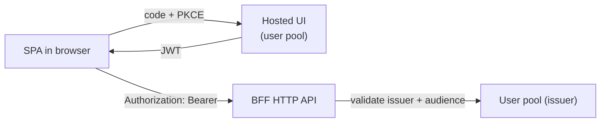
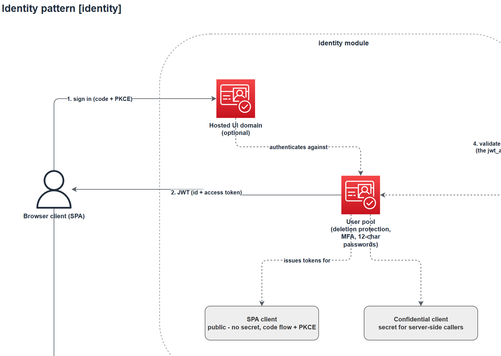

# Identity

The identity pattern provisions the OpenID Connect provider the rest of the library assumes: a
Cognito user pool, its app clients, and an optional hosted UI domain. Its `jwt_authorizer` output
plugs unchanged into every `jwt_authorizer` input in the library, which is what turns "the BFF
supports JWT auth" from an assumption into something a subsystem actually deploys.

Module: [`identity`](../../modules/patterns/identity).

## The problem it solves

Every user-facing pattern in the library validates JWTs: `bff_service` and the webhook side of
`esg_service` accept a `jwt_authorizer = { issuer, audience }` input, and API Gateway rejects any
request that does not carry a valid token from that issuer. But nothing in the library issued
tokens. Teams either wired a user pool by hand (re-deciding password policy, MFA, and client
security every time) or shipped without auth. This pattern makes the secure configuration the
default and the wiring a one-line pass-through.

## What it builds

- **One Cognito user pool** with the library's security posture baked in: deletion protection on,
  12-character minimum passwords with all complexity classes required, software-token MFA
  available to every user (`OPTIONAL` by default, `ON` to mandate it), email as the username with
  verified-email account recovery, and self sign-up disabled unless explicitly enabled.
- **One app client per entry in `clients`**, of two types:
  - `spa`: a public client — no secret, because a browser cannot keep one. Pairs with the
    authorisation-code flow and PKCE in the frontend.
  - `confidential`: a client with a secret, for server-side callers.
  - Every client hides username-existence errors, supports token revocation, and uses SRP and
    refresh-token flows only. The implicit grant is never enabled. Clients that declare
    `callback_urls` get the hosted-UI code flow.
- **Optionally, a hosted UI domain** (`hosted_ui_domain_prefix`), giving the pool a login page at
  `https://<prefix>.auth.<region>.amazoncognito.com` with no frontend code.

## How it fits



The pool is the issuer; the client IDs are the audience; the BFF's JWT authoriser checks both.

## Inputs

- `name`, `clients`, and `tags` are required. `clients` must be non-empty — the `jwt_authorizer`
  output needs an audience.
- Each client is `{ type, callback_urls?, logout_urls?, oauth_scopes?, *_token_validity? }`.
- `hosted_ui_domain_prefix` (default null) creates the hosted UI when set. Prefixes are
  region-unique, so include the environment in the name.
- `allow_self_sign_up` (default `false`), `mfa_configuration` (default `OPTIONAL`),
  `password_minimum_length` (default 12), `deletion_protection` (default `true`).

## Outputs

`jwt_authorizer` — `{ issuer, audience }`, shaped exactly for the `bff_service` / `esg_service` /
`api_http` input of the same name. Also `issuer`, `audience`, `user_pool_id`, `user_pool_arn`,
`client_ids` (keyed by your map keys), and `hosted_ui_base_url`.

```hcl
module "bff" {
  source = "…/modules/patterns/bff_service"
  # …
  jwt_authorizer = module.identity.jwt_authorizer
}
```

## When to use it

Use it whenever a subsystem has a user-facing API — which is any subsystem with a BFF. Skip it
when the subsystem is purely internal (control services and ESGs only), or when your organisation
already runs a central identity provider: in that case pass that provider's issuer and audience
directly to the `jwt_authorizer` inputs and do not deploy this pattern at all. Federation into the
pool (SAML/OIDC/social) and Cognito identity pools are out of scope by design; see the module
README for how to extend.

## Diagram



This is the **Identity** tab of [`patterns-clean.drawio`](../architecture/patterns-clean.drawio); open the source for the editable, zoomable version.

---

[Back to the pattern reference](README.md)
