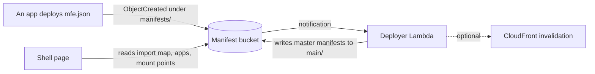
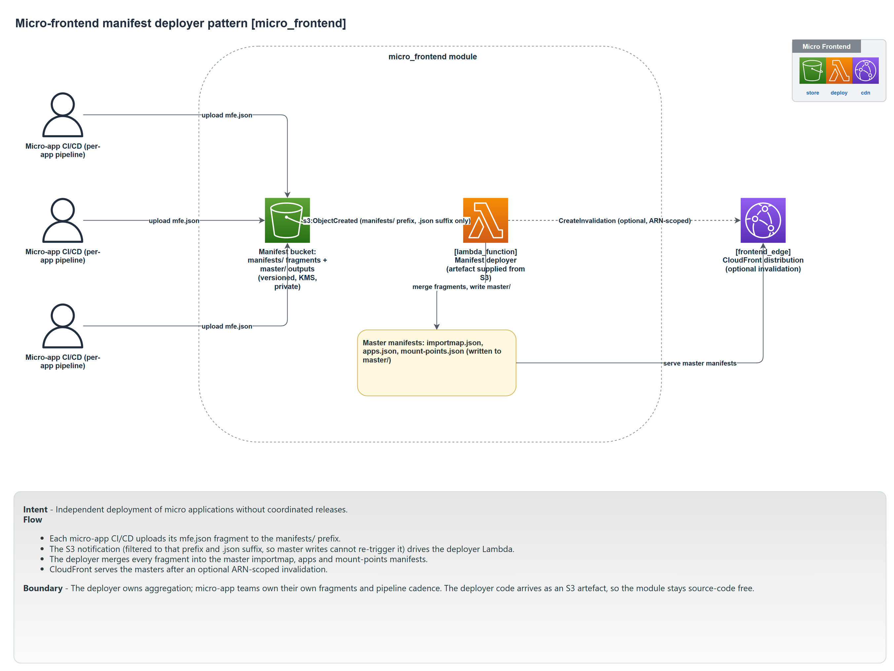

# Micro-frontend

The micro-frontend pattern lets several independently deployed frontend apps assemble into one page. It is a manifest store and a deployer: each app publishes a small fragment describing itself, and the deployer combines all the fragments into the master manifests a shell page loads (an import map, an app list, and mount points).

Module: [`micro_frontend`](../../modules/patterns/micro_frontend).

## The problem it solves

When a frontend is built by several teams as separate apps, something has to compose them at runtime: the shell page needs to know which apps exist, where each app's code is, and where on the page each mounts. Hard-coding that list couples every app's release to the shell's. Instead, each app deploys a `mfe.json` fragment, and a deployer recomputes the combined manifests whenever a fragment changes. Adding or updating an app is just writing its fragment; the shell picks it up without a coordinated release.

## What it builds

- **A manifest bucket** (named after the module, versioned, public access blocked, KMS-encrypted). It holds both the per-app fragments (under `manifests/` by default) and the combined master manifests (under `main/` by default).
- **A deployer Lambda** (`<name>-deployer`, via the [`lambda_function`](../../modules/primitives/lambda_function) primitive). It reads the fragments and writes the consolidated `importmap.json`, `apps.json`, and `mount-points.json` under the master prefix. Its IAM grants read and list on the whole bucket but write only to the master prefix.
- **An S3 event notification** that invokes the deployer on `ObjectCreated` events under the fragments prefix, filtered to `.json`. Writing a fragment triggers recomputation; the deployer's own writes to the master prefix do not re-trigger it.
- **Optional CloudFront invalidation**: when given a [frontend edge](frontend-edge.md) distribution id and ARN, the deployer is granted scoped `CreateInvalidation` so a fragment change can purge the edge cache. A precondition requires the ARN whenever the id is given.

## How it works



## Inputs

- `name`, `deployer_artefact`, and `tags` are required.
- `manifests_prefix` (default `manifests/`) and `master_prefix` (default `main/`) set the bucket layout.
- `frontend_edge_distribution_id` plus `frontend_edge_distribution_arn` enable cache invalidation on the paired edge distribution.

## Outputs

`bucket_name`, `bucket_arn`, the two prefixes, `deployer_function_name`, `deployer_function_arn`, and `kms_key_arn`.

## In a manifest

It sits under the `edge` block (alongside the frontend edge, since they pair) and, like the edge, is not provisioned by the composer:

```yaml
edge:
  enabled: true
  micro_frontend:
    enabled: true
    deployer_artefact: { bucket: my-artefacts, key: mfe/deployer.zip }
```

## When to use it

Use it only when a single frontend is genuinely composed from independently released apps and you need runtime composition. A frontend built and released as one app does not need it; serve that from the [frontend edge](frontend-edge.md) alone. This is the most specialised pattern in the library and the least often needed.

## Diagram



This is the **Micro Frontend** tab of [`patterns-clean.drawio`](../architecture/patterns-clean.drawio); open the source for the editable, zoomable version.

---

[Back to the pattern reference](README.md)
