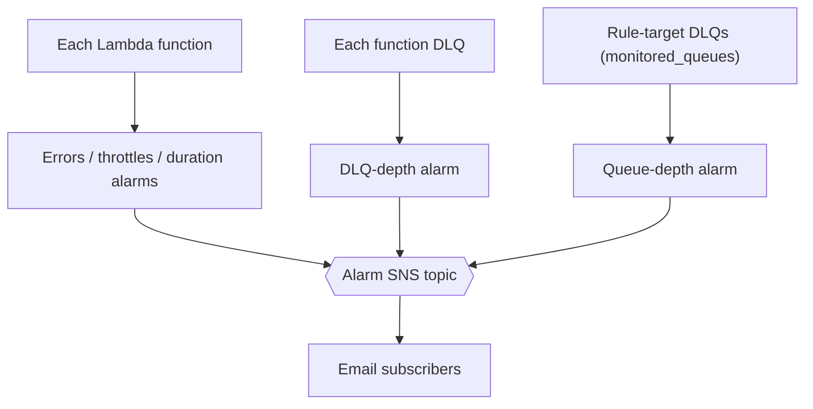

# Observability baseline

The observability baseline is the monitoring every subsystem gets by default: an alarm on each function and each off-Lambda queue, one alert topic they all publish to, a dashboard, and the environment variables that turn on structured logging and tracing. It makes a subsystem observable from the moment it is deployed, rather than after the first incident.

Module: [`observability_baseline`](../../modules/patterns/observability_baseline).

## The problem it solves

Monitoring added per service, after the fact, is uneven: some functions have alarms, some do not, thresholds differ, and failures in the gaps between services (an EventBridge rule that cannot deliver) are invisible. The baseline applies one consistent set of alarms across the whole subsystem from a single input, so every function is watched the same way and the queues that catch failed deliveries are watched too. It does not replace bespoke, domain-specific alarms; it guarantees a floor.

## What it builds

- **An SNS topic** (`<name>-alarms`), KMS-encrypted, with one email subscription per address in `notification_emails`. Every alarm publishes here.
- **Three alarms per function** in `lambda_functions`: errors (any error over five minutes), throttles (any throttle), and duration (p99 over 80% of the function's configured timeout). The duration threshold is derived from each function's `timeout_seconds`, so a function close to timing out is flagged before it starts failing.
- **A DLQ-depth alarm per function that has a dead-letter queue**: any visible message in the function's DLQ.
- **A queue-depth alarm per entry in `monitored_queues`**: any visible message. These are the queues not attached to a function, in particular the EventBridge rule-target DLQs. A message here means deliveries are failing silently, which is exactly the failure that is otherwise invisible.
- **A dashboard** (on by default) showing errors and throttles per function.

The module creates the topic but no topic policy; in a composition, the subsystem key's policy grants the services that publish to the topic.

## How it works



You hand the baseline two maps: the functions to watch and the off-Lambda queues to watch. It expands them into alarms, all routed to one topic, all delivered to the configured emails.

## The ADOT and Powertools variables

The module's `adot_environment_variables` output is a set of environment variables (the OpenTelemetry collector wrapper, sampling at 5%, X-Ray propagation, and Powertools logging and tracing settings). A caller merges these into each function's environment so logs are structured, traces are sampled consistently, and metrics share a namespace. The baseline produces the values; the functions consume them.

## Inputs that matter

- `name` and `tags` are required.
- `lambda_functions` is a map of `{ function_name, timeout_seconds, dlq_queue_name? }`. `timeout_seconds` sets the duration threshold; `dlq_queue_name` adds the DLQ-depth alarm.
- `monitored_queues` is a map of label to queue name, for queues with no owning function.
- `notification_emails` are the subscribers; `alarm_actions` adds extra targets; `create_dashboard` (default `true`) toggles the dashboard.

## Outputs

`alarm_topic_arn` (the topic other patterns send their alarms to), `adot_environment_variables`, `dashboard_name`, and `alarm_names` grouped by signal.

## In a manifest

```yaml
operations:
  observability:
    enabled: true
    emails: [oncall@example.com]
    dashboard: true
```

You do not list functions or queues in the manifest. The composer builds `lambda_functions` from every BFF, event-reactor control, and ESG function it created, and builds `monitored_queues` from every hub route DLQ and rule-target DLQ. That coverage is the point: every function and every silent-failure queue in the subsystem is watched without anyone enumerating them. See [Building a subsystem](../building-a-subsystem.md#monitoring-coverage).

## When to use it

Enable it for every subsystem; it is on by default. The only reason to pass `enabled: false` is a throwaway environment where you accept no monitoring. Disabling it also removes the alarm topic that the event lake and other patterns route their own alarms to.

## Diagram

The **Observability Baseline** tab of [`patterns-clean.drawio`](../architecture/patterns-clean.drawio) shows the alarm fan-in to the topic and the dashboard.

---

[Back to the pattern reference](README.md)
