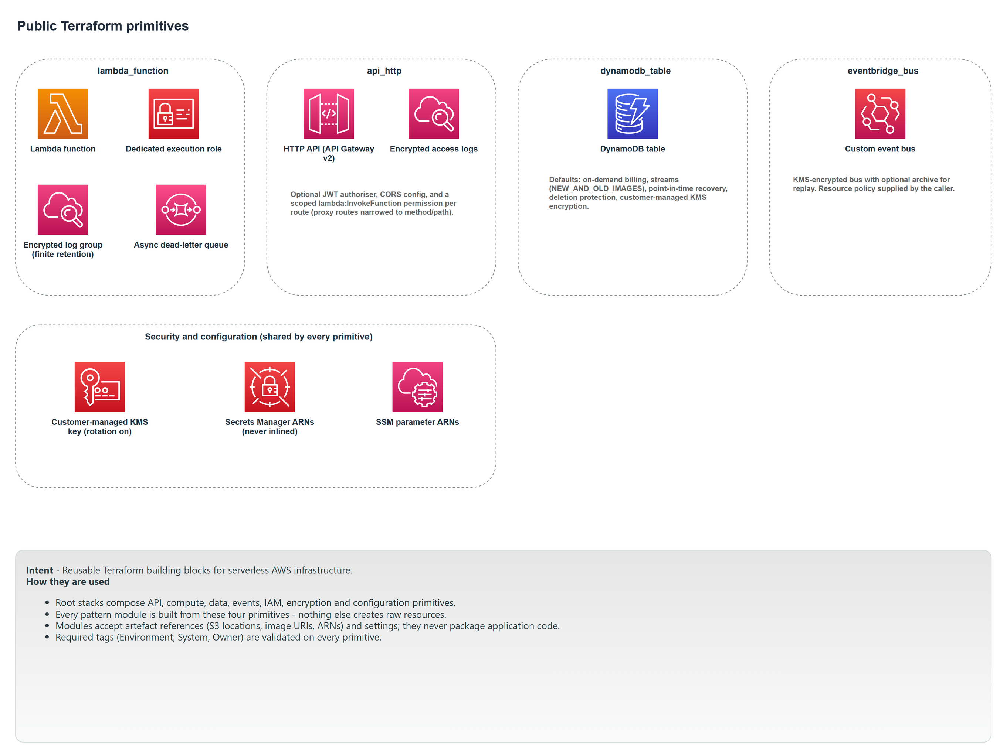

# Primitives

The primitives are four Terraform modules, each wrapping a single AWS resource and applying the library's security defaults. They are the vocabulary the patterns are written in: a pattern is a set of primitives plus the wiring between them. You can use a primitive directly, but most of the time a pattern calls it for you.

Each primitive is small and has one job. What they share is the [guarantees](README.md#guarantees-every-pattern-applies) every module applies: customer-managed encryption, finite log retention, required tags, and the `create_kms_key` switch.

| Primitive | Wraps | Module |
| --- | --- | --- |
| Lambda function | `aws_lambda_function` and everything it needs to run safely | [`lambda_function`](../../modules/primitives/lambda_function) |
| HTTP API | `aws_apigatewayv2_api` (HTTP API) with routes and authorisation | [`api_http`](../../modules/primitives/api_http) |
| DynamoDB table | `aws_dynamodb_table` with streams and recovery on by default | [`dynamodb_table`](../../modules/primitives/dynamodb_table) |
| EventBridge bus | `aws_cloudwatch_event_bus` with optional archive | [`eventbridge_bus`](../../modules/primitives/eventbridge_bus) |

---

## Lambda function

A single Lambda function, its execution role, its log group, and its dead-letter queue, provisioned together so a function is never deployed without the things it needs to be observable and to fail safely.

### What it builds

- **The function** (`aws_lambda_function.this`). Zip or container image, set by `package_type`. Defaults to the `arm64` architecture, the `nodejs20.x` runtime, 256 MB, a 10 second timeout, and active X-Ray tracing.
- **A dedicated execution role** (`aws_iam_role.this`, named `<name>-exec`) with an inline policy (`<name>-execution`). The policy always grants CloudWatch Logs write, X-Ray write, and use of the encryption key. It conditionally adds: send to the DLQ when one exists; read on the Secrets Manager ARNs in `secret_arns`; read on the SSM parameter ARNs in `parameter_arns`; and one statement per entry in `policy_statements`. This last input is how a pattern grants its function exactly the extra access it needs (for example `events:PutEvents` on the bus, or item access on a table) without the primitive knowing what the function does.
- **A KMS-encrypted log group** (`/aws/lambda/<name>`) with finite retention.
- **A dead-letter queue** (`<name>-dlq`), created by default, used as the function's asynchronous failure destination. You can disable it (`create_dead_letter_queue = false`) or point it at an existing queue (`dead_letter_queue_arn`).

### Inputs that matter

- `name`, `tags` are required. The artefact is `s3_bucket` plus `s3_key` for a zip, or `image_uri` for a container; a precondition enforces that you supply the right pair for the chosen `package_type`.
- `policy_statements` is the extension point: a list of `{ actions, resources }` objects appended to the execution policy.
- `secret_arns` and `parameter_arns` add scoped read permissions and nothing else.
- `log_retention_days` must be one of the finite periods CloudWatch Logs supports; `0` (unlimited) is rejected.

### Outputs

`function_name`, `function_arn`, `invoke_arn`, `execution_role_arn`, `log_group_name`, and `dead_letter_queue_arn` (the effective DLQ, whether created here or supplied).

### Notes

The DLQ defaults to the 14-day SQS maximum retention so a failed payload has the widest possible window for inspection. Patterns that invoke a Lambda synchronously from an event source mapping (SQS or a stream) pass `create_dead_letter_queue = false`, because the asynchronous DLQ would never receive anything and its default name would collide with the queue-level DLQ the pattern manages instead.

---

## HTTP API

An API Gateway v2 HTTP API: routes to Lambda integrations, optional JWT authorisation, access logging, and per-route invoke permissions. HTTP APIs are used rather than REST APIs because they are cheaper and lower latency, and JWT authorisation covers the library's needs.

### What it builds

- **The API** (`aws_apigatewayv2_api.this`, `HTTP` protocol) and a **stage** (default `$default`, auto-deploy on) with access logging to a KMS-encrypted log group (`/aws/apigateway/<name>`).
- **One integration, route, and Lambda permission per entry in `routes`.** Integrations are `AWS_PROXY` with payload format 2.0 and a fixed 30 second timeout. Each route's Lambda permission is scoped to that route's method and path, not the whole API: an `ANY /{proxy+}` route is granted `*` method on `/*`, while `GET /orders` is granted `GET` on `/orders`. A function can only be invoked through the route it was wired for.
- **An optional JWT authoriser** (`aws_apigatewayv2_authorizer.jwt`), created when `jwt_authorizer` is set. When present, routes default to JWT authorisation; each route can override.

### Inputs that matter

- `routes` is a map of `{ route_key, lambda_function_arn, lambda_function_name }`, with optional per-route `authorisation_type` and `authorisation_scopes`.
- `jwt_authorizer` is `{ issuer, audience }` (plus optional identity sources). Without it, routes are unauthenticated at the gateway, and any verification is the function's responsibility.
- `cors` configures CORS; it defaults to off (`null`).

### Outputs

`api_id`, `api_endpoint` (full URL), `api_domain_name` (host only, for use as a CloudFront origin), `execution_arn`, `stage_name`, and `authorizer_id`.

---

## DynamoDB table

A DynamoDB table configured for the database-first event pattern: streams, point-in-time recovery, and deletion protection are all on by default, so a table that backs a service is durable and publishes its changes without extra configuration.

### What it builds

- **The table** (`aws_dynamodb_table.this`) with on-demand billing by default (`PAY_PER_REQUEST`), customer-managed KMS encryption, **streams enabled** with `NEW_AND_OLD_IMAGES`, **point-in-time recovery enabled**, and **deletion protection enabled**.
- Optional TTL and global secondary indexes from inputs.

### Inputs that matter

- `name`, `hash_key`, `attributes`, and `tags` are required. `range_key`, `ttl`, and `global_secondary_indexes` are optional.
- `stream_enabled` (default `true`) controls whether the table emits a change stream. This is the source of database-first publication: a BFF or control service reads this stream and turns committed writes into events.
- `billing_mode` defaults to on-demand; capacities are only set when you switch to `PROVISIONED`.

### Outputs

`name`, `arn`, and `stream_arn` (the stream a trigger function reads).

### Notes

The three on-by-default protections are deliberate. Streams make the table a source of events. Point-in-time recovery and deletion protection make it hard to lose the authoritative copy of a service's data. All three are overridable per table, but the safe state is the default.

---

## EventBridge bus

A custom EventBridge bus, encrypted, with an optional archive for replay. This is the primitive the event hub pattern is built on.

### What it builds

- **The bus** (`aws_cloudwatch_event_bus.this`), encrypted with a customer-managed key.
- **An optional archive** (`aws_cloudwatch_event_archive.this`), created when `archive` is set, with its own event pattern and retention (default 30 days). An archive lets you replay past events onto the bus.
- **An optional resource policy** (`aws_cloudwatch_event_bus_policy.this`), created when `policy_json` is set, for cross-account or cross-service publish grants.

### Inputs that matter

- `name` and `tags` are required.
- `archive` is `{ name, event_pattern?, retention_days?, description? }`. Supplying it turns on replay; the event pattern narrows what is archived.
- `policy_json` attaches a bus policy verbatim.

### Outputs

`name`, `arn`, and `archive_arn` (null when no archive).

---

## Diagram

This is the **Primitives** tab of [`patterns-clean.drawio`](../architecture/patterns-clean.drawio); open the source for the editable, zoomable version.

---

[Back to the pattern reference](README.md)
