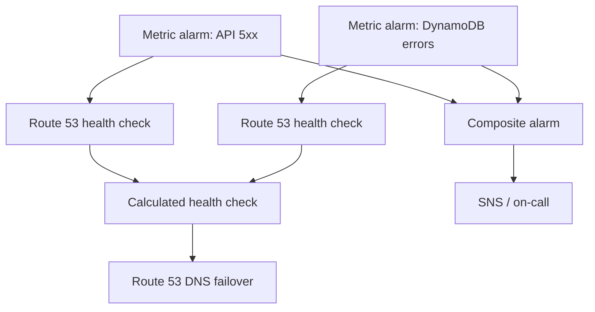
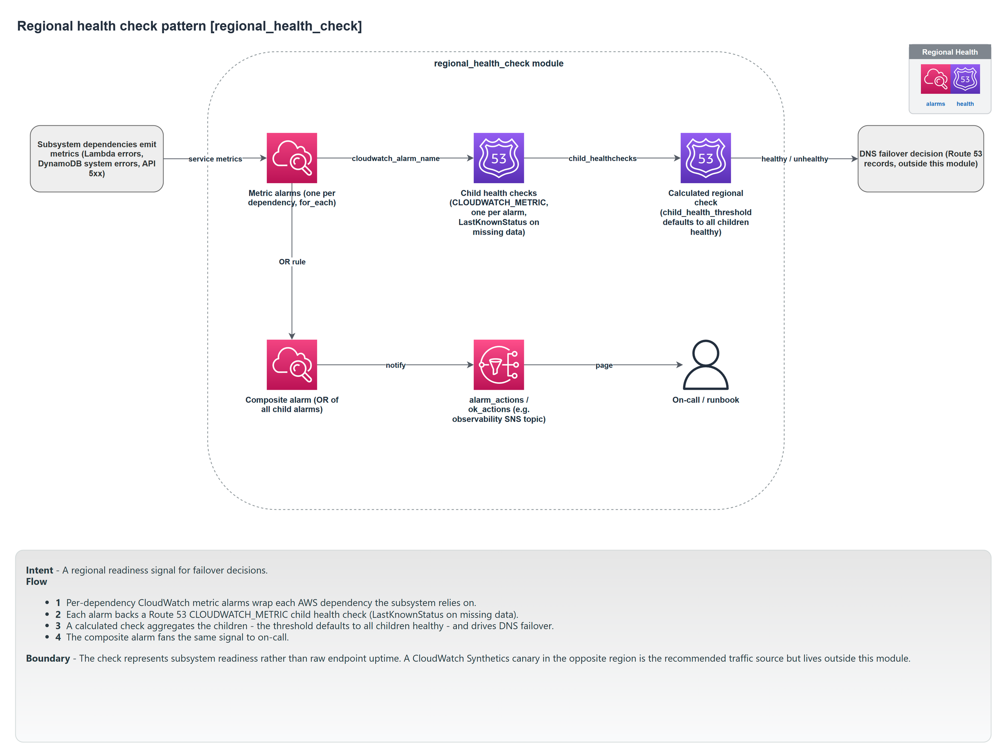

# Regional health check

The regional health check turns a set of CloudWatch alarms into a single health signal: a Route 53 health check that DNS failover can act on, and a composite alarm that notifies a human. It answers one question, "is this subsystem healthy in this region?", from the subsystem's own alarms.

Module: [`regional_health_check`](../../modules/patterns/regional_health_check).

## The problem it solves

Active-passive or active-active multi-region requires a machine-readable answer to "is the region healthy enough to send traffic to?" Route 53 can fail traffic away from a region, but only if it has a health check to read. A health check needs to reflect the things that actually matter for this subsystem (its API error rate, its database errors), not a single ping. This pattern aggregates the relevant alarms into one calculated health check Route 53 can use, and, separately, into one composite alarm a person can be paged on.

## What it builds

- **One CloudWatch metric alarm per entry in `metric_alarms`** (`<name>-<key>`), each watching a metric you specify (namespace, metric, statistic, threshold, dimensions).
- **One Route 53 health check per alarm** (type `CLOUDWATCH_METRIC`), evaluated in `region`, holding its last known status when data is missing.
- **One calculated Route 53 health check** (type `CALCULATED`) over all the child health checks. It reports healthy only when at least `child_health_threshold` children are healthy (default: all of them). This is the signal DNS failover reads.
- **One composite alarm** (`<name>-regional`) that ORs all the child alarms, routing to `alarm_actions`/`ok_actions`. This is the signal a human is notified on.

These are two independent aggregations over the same child alarms: the calculated health check drives automatic failover, the composite alarm drives notification. `inverted` flips the calculated check, which is useful for failover testing.

## How it works



## Inputs that matter

- `name`, `region`, `metric_alarms`, and `tags` are required. `metric_alarms` must be non-empty: a health check must observe something concrete.
- Each `metric_alarms` entry is `{ namespace, metric_name, statistic?, period?, evaluation_periods?, threshold?, comparison_operator?, dimensions?, ... }`.
- `child_health_threshold` (default: the number of alarms) sets how many children must be healthy. `inverted` flips the result for testing. `alarm_actions`/`ok_actions` are the composite alarm's targets.

## Outputs

`regional_health_check_id` and `regional_health_check_arn` (for Route 53 failover records), `regional_alarm_arn` and `regional_alarm_name` (the composite alarm), and the per-child maps.

## In a manifest

```yaml
operations:
  regional_health:
    enabled: true
    region: eu-west-2
```

This pattern is **off by default** (the only operation that is). When enabled, the composer builds the metric alarms for you from each BFF: a Lambda-errors alarm on the BFF's REST function and a system-errors alarm on its table. It therefore requires at least one BFF; the composer rejects `regional_health.enabled` with no BFFs.

## When to use it

Use it when a subsystem is deployed to more than one region and you want Route 53 to fail traffic away from an unhealthy one, or when you simply want a single rolled-up "is this region healthy" alarm. A single-region subsystem with no failover does not need it, which is why it is off by default.

## Diagram



This is the **Regional Health Check** tab of [`patterns-clean.drawio`](../architecture/patterns-clean.drawio); open the source for the editable, zoomable version.

---

[Back to the pattern reference](README.md)
