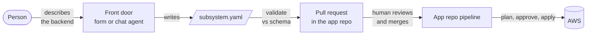

# Self-service and agentic integration

This guide is for whoever wants to put a friendly **front door** on this library: a form, an internal developer portal, or a chat agent that lets someone stand up a serverless backend **without writing Terraform**. The person describes what they want, the front door turns it into a single config file, and that file is reviewed and deployed through the normal pipeline.

It assumes you have skimmed the [project README](../README.md) for what the library is. It does not assume any particular platform or tooling on your side.

## The one idea to start with

Everything this library builds is driven by a single file: `subsystem.yaml`. It lists the services you want and the events that flow between them. A deterministic part of the library, the **composer** ([`modules/composition/subsystem`](../modules/composition/subsystem)), reads that file and expands it into the 150-200 AWS resources that implement it: HTTP APIs, Lambda functions, DynamoDB tables, the event bus, queues, a KMS key, IAM roles, and alarms.

That is what makes a front door simple. It never has to understand Terraform or AWS. Its only job is to **produce a valid `subsystem.yaml`**. That file is the entire contract between any front door and this library.

> [!NOTE]
> One self-contained, event-driven backend like this is called a **subsystem**. That is the word the config file and the rest of the docs use. If "subsystem" feels heavy, read it as "one backend."

## What happens end to end



1. **Describe.** A person fills in a form or talks to an agent.
2. **Emit.** The front door writes a `subsystem.yaml`.
3. **Validate.** The file is checked against the [schema](../schema/subsystem.schema.json).
4. **Land.** It is committed as a pull request to an **application repository**: the small Git repo that owns one backend's Terraform state and its deploy. App repos are scaffolded from the [`subsystem-app` template](../templates/subsystem-app).
5. **Review.** A human reads the PR and merges it.
6. **Deploy.** The app repo's own pipeline plans and applies to AWS behind an approval gate.

The boundary matters: a front door only ever does steps 1 to 4. It produces a config file and opens a PR. It does not run Terraform and it cannot deploy. A person merges, and the app repo deploys. That is what keeps an automated or agentic front door safe: its entire blast radius is one schema-validated YAML file that a human reviews.

## The config file

Here is a minimal manifest for an *orders* backend, to make the contract concrete:

```yaml
# infra/terraform/subsystem.yaml
subsystem: orders
tags: { Environment: dev, System: commerce, Owner: orders-team }
artefact_defaults: { bucket: orders-artefacts }

bffs:
  - { name: cart, path: /cart/*, publishes: [OrderPlaced] }

controls:
  - { name: fulfilment, mode: step_functions, subscribes: [OrderPlaced] }

esgs:
  - { name: shipping, external: dhl, egress: [ShipmentRequested], webhook: true }

operations:
  event_lake: { enabled: true }
  fault_monitor: { enabled: true }
  observability: { enabled: true }
```

The top-level keys are the building blocks. A front door only needs to know enough to fill them in:

| In the config | What it is |
| --- | --- |
| `bffs` | A user-facing service: an HTTP API, its functions, and its own database. One per user activity such as *checkout* or *account*. Called a **BFF** (backend for frontend). |
| `controls` | A service that reacts to events to make a decision or run a process. An **event-reactor** (derive a new event from observed ones) or a **saga** (`mode: step_functions`, a workflow with waits, retries, and compensation). |
| `esgs` | A gateway around an external system such as a payment provider or partner API. It turns their inbound webhooks into your events and delivers your outbound events to their API. Called an **ESG** (external service gateway). |
| `operations` | Cross-cutting, on by default: an **event lake** (replayable audit log), a **fault monitor** (catches failures for resubmission), and **observability** (alarms, dashboards, tracing). |

The services connect through events, never by calling each other directly: a control `subscribes` to an event that a BFF `publishes`. The event names are yours; keep them consistent across `publishes`, `subscribes`, and `egress`.

For the full vocabulary, point readers at the [pattern catalogue](../README.md#the-pattern-catalogue) and the **Pattern Icons** page of [`patterns-clean.drawio`](architecture/patterns-clean.drawio). Every field is defined in the [schema](../schema/subsystem.schema.json), and there is a fuller [payouts example](../examples/systems/payouts-subsystem/subsystem.yaml).

## Building the front door

A front door is anything that ends up writing a valid `subsystem.yaml`. Two common shapes:

### A form or portal

Collect a few fields, template them into a manifest, validate it, open the PR. Fully deterministic, no AI required.

If you already run an infrastructure self-service pipeline, you are most of the way there. A typical one does: collect parameters, fetch a Terraform template, fill in its variables, open a PR, file a ticket, notify a channel. Adopting this library only changes the middle:

| A typical infra pipeline step | With this library |
| --- | --- |
| Collect parameters (form fields) | **Describe the subsystem**: form fields, or the conversation below, emitting `subsystem.yaml` |
| Fetch a Terraform template | *Gone.* The composer is the template, and it already lives in the library |
| Fill in template variables | **Validate the manifest** against the schema |
| Open a branch, commit, PR | **Land the manifest**: PR `infra/terraform/subsystem.yaml` into the app repo (creating it from the template first if it is new) |
| File a ticket, notify a channel | Unchanged |

The ticket-and-notify tail is exactly today's GitOps flow. The genuinely new pieces are emitting a manifest, validating it, and landing it in the *app* repo (never in this library, which is only ever a pinned dependency).

### A chat agent

Instead of form fields, an agent has a conversation and emits the manifest. This is where an agent earns its keep: translating "payouts needs a compliance check before money moves, and a gateway to our bank" into `controls: [{ mode: event_reactor, subscribes: [PayoutRequested] }]` and `esgs: [{ name: banking-rails, egress: [TransferInstructed] }]`.

Give the agent three things:

1. **The schema** ([`schema/subsystem.schema.json`](../schema/subsystem.schema.json)), in context, so it emits valid manifests and can self-correct. A schema-aware model will fill required fields and respect enums and patterns.
2. **A worked example** ([`examples/systems/payouts-subsystem/subsystem.yaml`](../examples/systems/payouts-subsystem/subsystem.yaml)) as a few-shot anchor for tone and structure.
3. **The pattern vocabulary**: the **Pattern Icons** page and per-pattern tabs of [`patterns-clean.drawio`](architecture/patterns-clean.drawio), plus the book. Load these into the agent's knowledge base so it can also answer "which pattern do I need?" mid-conversation.

A system prompt skeleton to start from:

> You help engineers describe an autonomous serverless subsystem as a `subsystem.yaml` manifest for the serverless-architecture-patterns library. Elicit: the user activities (each becomes a BFF), the decisions or orchestration the subsystem makes (control services: reactors for "derive an event from events", Step Functions sagas for multi-step processes with waits and compensation), the external systems it talks to (ESG gateways), and which events flow between them. Map everything to the manifest schema provided. Never write Terraform. Produce only a manifest that validates against the schema; if unsure which pattern fits, ask, and consult the pattern knowledge base. Default the operations block on (event lake, fault monitor, observability). Flag that artefact buckets, notification emails, and any Step Functions definition are placeholders the team fills in before applying.

## Getting the manifest into the app repo

Two transports land the file. Both end the same way: `infra/terraform/subsystem.yaml` in the app repo, in a PR, merged by a human.

**Greenfield** means the app repo does not exist yet, so it is created from the template first. **Brownfield** means the repo already exists, so only the manifest changes, via a PR.

**Option A: call the `author-subsystem` workflow (least code on your side).**

```sh
gh workflow run author-subsystem.yml \
  -f target_repo=<org>/<app> \
  -f create_if_missing=true \
  -f manifest="$(cat subsystem.yaml)"
```

The [`author-subsystem`](../.github/workflows/author-subsystem.yml) workflow validates the manifest, then either scaffolds a new app repo from the template (greenfield) or opens a PR updating the manifest in an existing one (brownfield). Because it writes into *another* repository, the default `GITHUB_TOKEN` is not enough: set the `SUBSYSTEM_AUTHOR_TOKEN` secret to a GitHub App installation token or fine-grained PAT with Administration, Contents, and Pull requests (read and write) on the target org. Attach your ticket-and-notify steps afterward.

**Option B: use your own GitHub connector.** If your platform already does "create branch, commit, PR," point it at the app repo: write `infra/terraform/subsystem.yaml` to a branch via the Contents API and open a PR, creating the repo from the template first if greenfield. Same result, authored by your connector, no shared token to manage. Prefer this if you want the PR to look identical to the ones your pipeline opens today.

## Guardrails worth keeping

- **The PR is the gate.** A front door only validates and writes a file. A human merges, and the app repo's pipeline applies behind an environment approval. Nothing here can deploy on its own.
- **Schema validation is non-negotiable.** It runs in the workflow and again in CI (the `manifest schema` job), so a malformed manifest never becomes a deploy.
- **Artefacts stay the team's responsibility.** The library ships no application code; the manifest references the S3 locations where your CI publishes Lambda zips. A front door, agentic or not, should never invent bucket contents.
- **Payments specifics.** Remind users that idempotency keys must travel in the event detail (the architecture retries at several layers) and that sagas need a real Step Functions definition: the module ships a no-op placeholder the team replaces before applying.
