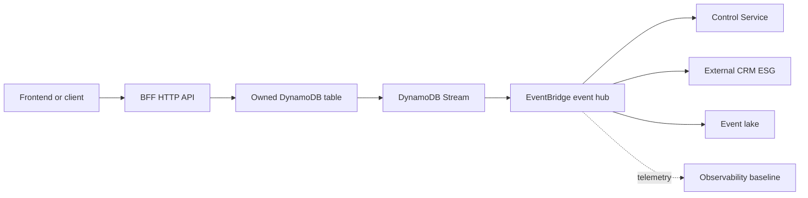

# Customer Engagement System Example

This example is a complete **composition recipe** for an autonomous serverless subsystem. It shows how an application team can assemble the repository building blocks into a deployable customer-engagement system.

It is not an application implementation. The Lambda code for the BFF, Control Service, and ESG is expected to be built and published by application CI/CD pipelines. This root stack consumes those artefact references and provisions the AWS infrastructure around them.

## What This Example Demonstrates

The example composes these building blocks:

| Responsibility | Building block |
| --- | --- |
| Asynchronous collaboration | `modules/patterns/event_hub` |
| Frontend-facing API and owned read model | `modules/patterns/bff_service` |
| Event-driven policy reaction | `modules/patterns/control_service` |
| External CRM boundary | `modules/patterns/esg_service` |
| Analytical event storage | `modules/patterns/event_lake` |
| Logs, metrics, traces, alarms, and dashboard | `modules/patterns/observability_baseline` |

The important thing to notice is the division of responsibility:

- Application pipelines publish immutable artefacts such as `customer-engagement/bff/rest/1.0.0/app.zip`.
- Terraform receives those artefact references through variables.
- The pattern modules create the AWS resources, permissions, event routes, data stores, queues, logs, alarms, and integration points.
- The root stack supplies the composition glue between modules, such as routing selected event hub facts into the event lake.

## System Shape



## Artefact Inputs

The root stack expects artefact references for each deployable service component:

- `bff_artefacts.rest`: HTTP API handler.
- `bff_artefacts.listener`: asynchronous event listener.
- `bff_artefacts.trigger`: DynamoDB stream publisher.
- `control_artefacts.listener`: Control Service event collector.
- `control_artefacts.trigger`: Control Service decision publisher.
- `external_crm_artefacts.ingress`: external webhook normaliser.
- `external_crm_artefacts.egress`: outbound external CRM adapter.

These are deliberately modelled as inputs. This keeps the example aligned with production delivery: build and release pipelines own application artefacts; Terraform owns infrastructure composition.

## Configuration Inputs

External CRM credentials are also inputs:

- `external_crm_secret_arns`
- `external_crm_parameter_arns`

The ESG module grants read access to those references. It does not inline secret values.

## Validate The Composition

```bash
terraform init -backend=false
terraform validate
```

To produce a plan, copy `terraform.tfvars.example`, replace the placeholder S3 bucket and key values with real artefact locations, then run:

```bash
terraform plan -var-file=dev.tfvars
```

## Apply In A Dev Account

```bash
terraform apply -var-file=dev.tfvars
```

Before applying, make sure:

- The artefact bucket and keys exist.
- The event lake bucket name is globally unique.
- Secret and parameter ARNs refer to existing AWS resources if the ESG needs them.
- The AWS credentials used by Terraform can create IAM, Lambda, API Gateway, DynamoDB, EventBridge, SQS, Firehose, S3, CloudWatch, SNS, and KMS resources.

## Why There Is No Source Code Here

This repository is a library of application architecture building blocks. Including real business code in the system example would blur that boundary. The example therefore focuses on how the infrastructure blocks compose, where artefact references enter, and how a team would substitute its own built services.
