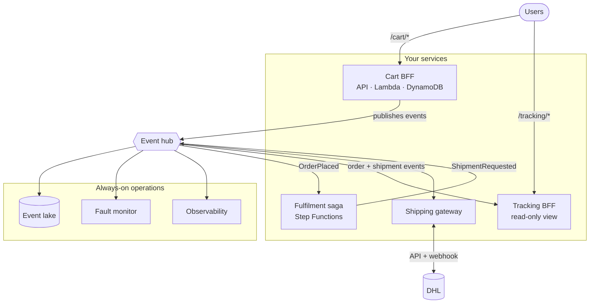

# Serverless backend, from one config file

Stand up a complete, production-ready **event-driven backend on AWS** by editing one short YAML file. You don't write Terraform: a versioned pattern library turns your config into the APIs, functions, databases, event wiring, queues, encryption, IAM and monitoring that implement it, with secure defaults baked in.

This template gives you a ready-to-deploy repository: the config, the deploy pipeline, and a working starter. Edit the config, drop in your handler code, and ship. It's the fast path for a team that needs a new backend without hand-building (or hand-securing) the infrastructure each time.

> The architecture this builds is documented in the [pattern library](https://github.com/dpdesi/serverless-architecture-patterns). One backend like this is called a **subsystem** there; that's the word the config file and the docs use.

---

## What it builds

Here's a real config (an *orders* backend) and exactly what comes out of it.

```yaml
# infra/terraform/subsystem.yaml
subsystem: orders            # the name of this backend
tags: { Environment: dev, System: commerce, Owner: orders-team }

artefact_defaults:
  bucket: orders-artefacts   # where your Lambda zips are published

bffs:                        # user-facing services: API + functions + a database
  - name: cart
    path: /cart/*
    publishes: [CartCheckedOut, OrderPlaced]
  - name: tracking
    path: /tracking/*
    read_only: true          # its data is built from events, not writes
    subscribes: [OrderPlaced, ShipmentRequested]

controls:                    # services that react to events / run workflows
  - name: fulfilment
    mode: step_functions     # a saga: a multi-step process with compensation
    subscribes: [OrderPlaced]

esgs:                        # gateways to external systems
  - name: shipping
    external: dhl
    egress: [ShipmentRequested]
    webhook: true

operations:                  # audit, alerting, monitoring (on by default)
  event_lake: { enabled: true }
  fault_monitor: { enabled: true, emails: [oncall@example.com] }
  observability: { enabled: true }
```

That config produces this backend:



And in your AWS account, that is roughly **150 resources you didn't have to wire**:

- **3 HTTPS APIs** and **8 Lambda functions** across the services
- **2 DynamoDB tables** whose change streams feed the event flow
- an **EventBridge bus** with the routing above, plus an **SQS queue and a dead-letter queue on every async hop** so nothing is silently lost
- a **Step Functions** state machine for the fulfilment saga
- an immutable, versioned **S3 event lake** for audit and replay
- **CloudWatch alarms, a dashboard, and X-Ray tracing**
- **one KMS key** encrypting all of it, and a **least-privilege IAM role** per function

Change the config, get a different backend. Remove `controls` and you drop the saga. Add another `bffs` entry and you get another API + database + its event wiring. The infrastructure follows the config.

---

## The building blocks

The config is made of these. Pick the ones you need:

| Block | What it is |
| --- | --- |
| **Event hub** | A private event bus at the centre. Services publish facts and subscribe to the events they care about; they never call each other directly, so one service failing doesn't cascade. |
| **BFF** (Backend for Frontend) | A service for one user activity: an HTTP API + functions + its own database, plus the wiring to publish its changes as events and build read-models from events it subscribes to. One per activity (e.g. *checkout*, *account*). |
| **Control service** | A service that reacts to events to make a decision or run a process. An **event-reactor** (derive a new event from observed ones) or a **saga** (a Step Functions workflow with waits, retries and compensation). |
| **ESG** (External Service Gateway) | A boundary around an external system such as a payment provider or partner API. It turns inbound webhooks into your events and delivers your outbound events to the external API, so external quirks stay contained. |
| **Operations** | Cross-cutting, on by default: an **event lake** (replayable audit trail), a **fault monitor** (catches failures for resubmission), and an **observability baseline** (alarms, dashboards, tracing). |

The events under `publishes` / `subscribes` / `egress` are how blocks connect: a control `subscribes` to what a BFF `publishes`. Names are yours; keep them consistent. Every field is described in the [schema](https://github.com/dpdesi/serverless-architecture-patterns/blob/main/schema/subsystem.schema.json) (point your editor's YAML language server at the `$schema` line in the config for autocomplete), and there's a fuller [payments example](https://github.com/dpdesi/serverless-architecture-patterns/tree/main/examples/systems/payouts-subsystem).

---

## Get started

**One-time per AWS account** (admin credentials):

1. **Deploy role**: run [`scripts/iac-role.sh`](scripts/iac-role.sh) (`ORG=<org> REPO=<this-repo> ./scripts/iac-role.sh`). Creates the GitHub OIDC provider and the IAM role the workflows assume; no AWS keys are stored.
2. **State bucket**: run the **Provision state bucket** Action (Actions tab).
3. **Artefact bucket**: deploy the library's [`artefact_pipeline`](https://github.com/dpdesi/serverless-architecture-patterns/tree/main/modules/delivery/artefact_pipeline) module (a small bootstrap root is enough - see its README). It creates a versioned, KMS-encrypted, TLS-only bucket plus an optional OIDC publisher role scoped to this repository. Set the module's `bucket_name` output as `artefact_defaults.bucket` in your config. Any versioned private bucket works, but the module is the tested path. The `manage-infra` workflow runs [`scripts/preflight.sh`](scripts/preflight.sh) before every plan and apply, so a missing bucket or missing artefact fails with instructions rather than an opaque Terraform error.

**One-time per environment** (dev / staging / prod, as [GitHub Environments](https://docs.github.com/en/actions/deployment/targeting-different-environments)):

4. Set Variables: `AWS_ACCOUNT_ID` (required), `AWS_REGION` (default `eu-west-2`), `IAC_ROLE_NAME` (if not the default).
5. On `prod`, add **required reviewers**. That approval is your deploy gate.

**Then, to ship:**

1. Edit [`infra/terraform/subsystem.yaml`](infra/terraform/subsystem.yaml) (the starter is a single BFF plus operations, enough to deploy).
2. Add your handler code under `services/` (the starter ships working stubs).
3. Open a PR. CI validates the config and runs `terraform validate`.
4. Run the **Manage infrastructure** Action with `plan`, review, then `apply` (it waits for the environment approval).

---

## Your code

Handler code lives in `services/`, one directory per component, named to match the config:

```
services/
  cart/         rest/  listener/  trigger/    # a BFF
  fulfilment/   listener/  trigger/           # an event-reactor control
  shipping/     ingress/  egress/             # an ESG
```

The deploy builds each component found here and publishes its zip where the library expects it. **Co-location is the default**, the right choice when one team owns the backend. Add a `package.json` and the build runs `npm ci`; otherwise it just zips the directory.

**Code owned by another team?** Leave its source out and point that component at its externally-published artefact in the config; the build skips it:

```yaml
controls:
  - name: pricing
    mode: event_reactor
    subscribes: [PriceRequested]
    artefacts:
      listener: { bucket: pricing-artefacts, key: pricing/listener/1.4.2.zip }
```

See [`services/README.md`](services/README.md).

---

## Reference

**Deploying** runs from the **Manage infrastructure** Action: `plan` (preview, makes nothing), `apply` (builds artefacts, then applies behind the approval gate), `destroy-plan` / `destroy`. State is keyed per environment, authentication is OIDC, no stored credentials. For a public frontend, set `edge.enabled: true` and the root provisions CloudFront/ACM in `us-east-1`; otherwise that stays dormant.

**Layout**:

```
infra/terraform/subsystem.yaml   the config you edit
infra/terraform/main.tf          one module call to the library + an edge slot
services/                        your handler code
scripts/                         build-artefacts (publishes zips) · iac-role (bootstrap)
.github/workflows/               manage-infra · ci · state-bucket
```

**Troubleshooting**:

- *`terraform init` 404s on the library*: it's a pinned, private dependency (`?ref=v0.2.0`); make sure the tag exists and this repo can access it.
- *Apply fails, Lambda code not found in S3*: the artefact bucket is missing or the build didn't run (apply, not plan, builds and uploads).
- *Apply fails assuming the role*: re-run `scripts/iac-role.sh` and check `AWS_ACCOUNT_ID` is set on the environment.
- *Config rejected in CI*: the `manifest schema` job names the offending field.

**Learn more**: [pattern library](https://github.com/dpdesi/serverless-architecture-patterns) · [architecture diagram](https://github.com/dpdesi/serverless-architecture-patterns/blob/main/docs/architecture/patterns-clean.drawio) · [config schema](https://github.com/dpdesi/serverless-architecture-patterns/blob/main/schema/subsystem.schema.json) · [worked payments example](https://github.com/dpdesi/serverless-architecture-patterns/tree/main/examples/systems/payouts-subsystem)
